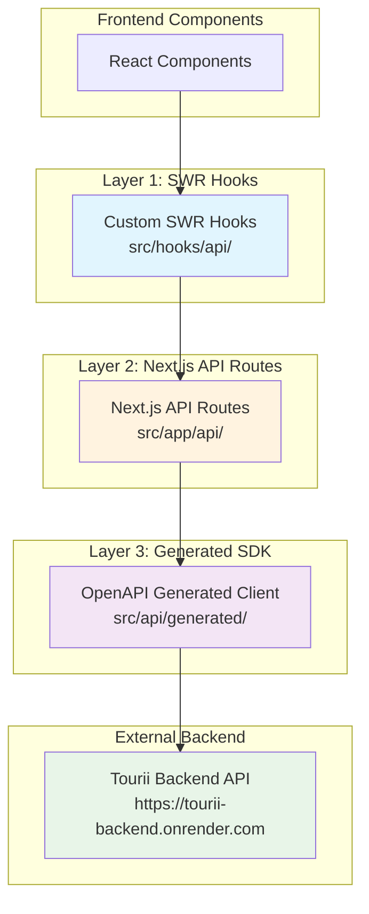
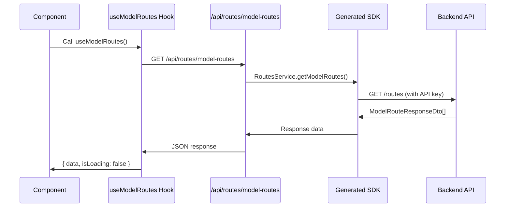
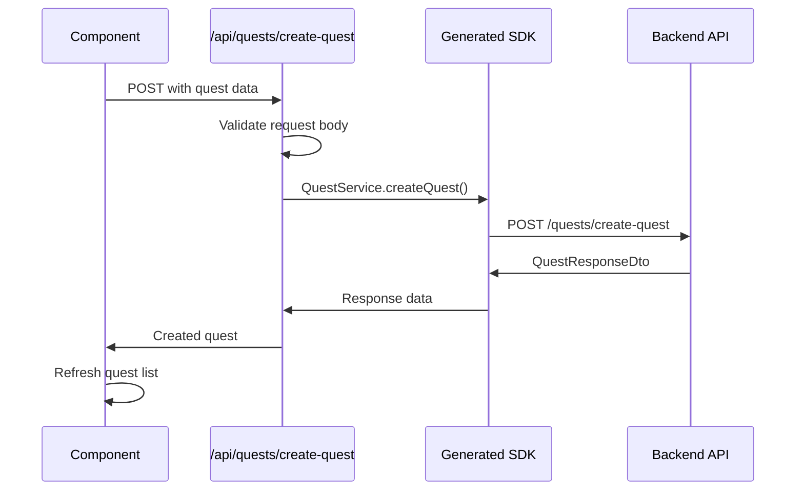

# 🔗 Complete API Integration Guide

This comprehensive guide covers the integration patterns, authentication, and API communication between the Tourii frontend and backend systems.

---

## 🏗️ **Three-Layer API Architecture**

The Tourii frontend follows a sophisticated three-layer pattern for backend communication:



### Architecture Benefits

- **Layer 1 (SWR Hooks)**: Caching, error handling, loading states, client-side data management
- **Layer 2 (API Routes)**: API key protection, request validation, error transformation, middleware
- **Layer 3 (Generated SDK)**: Type safety, automatic code generation, consistent API calls
- **Security**: API keys never exposed to client-side code, proper authentication handling

---

## 📋 **Current API Endpoints**

Based on the latest OpenAPI specification, here are the available backend endpoints:

### 🔧 Health & System
| Method | Endpoint        | Description             |
| ------ | --------------- | ----------------------- |
| `GET`  | `/health-check` | API health status check |

### 👤 User Management & Authentication
| Method | Endpoint               | Description                               |
| ------ | ---------------------- | ----------------------------------------- |
| `POST` | `/auth/signup`         | User registration with social/wallet auth |
| `POST` | `/login`               | User authentication                       |
| `POST` | `/user`                | Create new user                           |
| `GET`  | `/user/me`             | Get current user profile                  |
| `GET`  | `/user/sensitive-info` | Get user sensitive information            |

### 📚 Stories & Chapters
| Method   | Endpoint                                 | Description                    |
| -------- | ---------------------------------------- | ------------------------------ |
| `POST`   | `/stories/create-saga`                   | Create new story saga          |
| `POST`   | `/stories/create-chapter/{storyId}`      | Create chapter for story       |
| `POST`   | `/stories/update-saga`                   | Update existing saga           |
| `POST`   | `/stories/update-chapter`                | Update existing chapter        |
| `GET`    | `/stories/sagas`                         | Get all story sagas            |
| `GET`    | `/stories/sagas/{storyId}/chapters`      | Get chapters by story ID       |
| `POST`   | `/stories/chapters/{chapterId}/progress` | Track chapter reading progress |
| `POST`   | `/stories/chapters/{chapterId}/action`   | Execute chapter action         |
| `DELETE` | `/stories/{storyId}`                     | Delete story saga              |
| `DELETE` | `/stories/chapters/{chapterId}`          | Delete story chapter           |

### 🗺️ Routes & Tourist Spots
| Method   | Endpoint                                     | Description                          |
| -------- | -------------------------------------------- | ------------------------------------ |
| `POST`   | `/routes/create-model-route`                 | Create new model route               |
| `POST`   | `/routes/create-tourist-spot/{modelRouteId}` | Add tourist spot to route            |
| `POST`   | `/routes/update-model-route`                 | Update existing route                |
| `POST`   | `/routes/update-tourist-spot`                | Update tourist spot                  |
| `GET`    | `/routes`                                    | Get all model routes                 |
| `GET`    | `/routes/{id}`                               | Get specific model route             |
| `GET`    | `/routes/{modelRouteId}`                     | Get route by ID                      |
| `GET`    | `/routes/tourist-spots/{storyChapterId}`     | Get spots by chapter                 |
| `GET`    | `/location-info`                             | Get location info with Google Places |
| `DELETE` | `/routes/tourist-spot/{touristSpotId}`       | Delete tourist spot                  |

### 🎯 Quests & Tasks
| Method   | Endpoint                               | Description                          |
| -------- | -------------------------------------- | ------------------------------------ |
| `GET`    | `/quests`                              | Get quests with pagination & filters |
| `GET`    | `/quests/{questId}`                    | Get quest by ID                      |
| `GET`    | `/quests/tourist-spot/{touristSpotId}` | Get quests by tourist spot           |
| `POST`   | `/quests/tourist-spot/{touristSpotId}` | Create quest for specific tourist spot |
| `POST`   | `/quests/create-quest`                 | Create new quest                     |
| `POST`   | `/quests/create-task/{questId}`        | Create quest task                    |
| `POST`   | `/quests/update-quest`                 | Update existing quest                |
| `POST`   | `/quests/update-task`                  | Update quest task                    |
| `POST`   | `/quests/tasks/{taskId}/photo-upload`  | Upload task photo                    |
| `DELETE` | `/quests/{questId}`                    | Delete quest                         |
| `DELETE` | `/quests/tasks/{taskId}`               | Delete quest task                    |

### 👥 Group Features
| Method | Endpoint                          | Description             |
| ------ | --------------------------------- | ----------------------- |
| `GET`  | `/quests/{questId}/group/members` | Get group quest members |
| `POST` | `/quests/{questId}/group/start`   | Start group quest       |

### 📱 Check-ins & Moments
| Method | Endpoint    | Description                 |
| ------ | ----------- | --------------------------- |
| `GET`  | `/checkins` | Get user check-ins          |
| `GET`  | `/moments`  | Get latest traveler moments |

### 👤 User & Passport
| Method | Endpoint    | Description                                                |
| ------ | ----------- | ---------------------------------------------------------- |
| `GET`  | `/passport` | Get user's digital passport data with travel history and blockchain NFTs |

### 🎬 Story Actions & Completion
| Method | Endpoint                                  | Description                          |
| ------ | ----------------------------------------- | ------------------------------------ |
| `POST` | `/stories/chapters/{chapterId}/complete` | Complete story chapter and unlock quests with gamification rewards |

### 👥 Admin & User Management
| Method | Endpoint               | Description                               |
| ------ | ---------------------- | ----------------------------------------- |
| `GET`  | `/admin/users`         | Get all users with pagination and filtering (Admin only) |

### 🏠 Homepage & Content
| Method | Endpoint                  | Description                                |
| ------ | ------------------------- | ------------------------------------------ |
| `GET`  | `/homepage/highlights`    | Get homepage highlights with latest stories and popular quests |

### 🎯 Task Submission System
| Method | Endpoint                           | Description                              |
| ------ | ---------------------------------- | ---------------------------------------- |
| `POST` | `/tasks/submit/answer-text`        | Submit text answer for quest task        |
| `POST` | `/tasks/submit/check-in`           | Submit GPS location check-in for task    |
| `POST` | `/tasks/submit/select-options`     | Submit multiple choice answer for task   |

---

## 🎣 **Hook Implementation Patterns**

### 1. Basic Data Fetching Hook

```typescript
// src/hooks/api/useModelRoutes.ts
import { useProxySWR, type UseApiHookResult } from '@/lib/swr/useProxySWR';
import type { ModelRouteResponseDto } from '@/api/generated';

export function useModelRoutes(): UseApiHookResult<ModelRouteResponseDto[]> {
  const { data, error, isLoading, mutate } = useProxySWR<ModelRouteResponseDto[]>(
    "/api/routes/model-routes"
  );
  
  return { data, error, isLoading, mutate };
}

// Usage in components
function RouteList() {
  const { data: routes, error, isLoading, mutate } = useModelRoutes();
  
  if (isLoading) return <RouteListSkeleton />;
  if (error) return <ErrorDisplay error={error} retry={mutate} />;
  
  return (
    <div className="grid grid-cols-1 md:grid-cols-2 lg:grid-cols-3 gap-4">
      {routes?.map(route => (
        <RouteCard key={route.modelRouteId} route={route} />
      ))}
    </div>
  );
}
```

### 2. Parameterized Hook

```typescript
// src/hooks/api/useModelRouteById.ts
export function useModelRouteById(routeId: string | null): UseApiHookResult<ModelRouteResponseDto> {
  const { data, error, isLoading, mutate } = useProxySWR<ModelRouteResponseDto>(
    routeId ? `/api/routes/${routeId}` : null // Conditional fetching
  );
  
  return { data, error, isLoading, mutate };
}

// Usage with conditional fetching
function RouteDetail({ routeId }: { routeId: string | null }) {
  const { data: route, error, isLoading } = useModelRouteById(routeId);
  
  if (!routeId) return <RouteSelection />;
  if (isLoading) return <RouteDetailSkeleton />;
  if (error) return <ErrorDisplay error={error} />;
  if (!route) return <NotFound />;
  
  return <RouteDisplay route={route} />;
}
```

### 3. Query Parameters Hook

```typescript
// src/hooks/api/useQuests.ts
interface QuestFilters {
  page?: number;
  limit?: number;
  isPremium?: boolean;
  questType?: string;
  userId?: string;
}

export function useQuests(filters?: QuestFilters): UseApiHookResult<QuestListResponseDto> {
  const queryParams = new URLSearchParams();
  
  if (filters?.page) queryParams.set('page', String(filters.page));
  if (filters?.limit) queryParams.set('limit', String(filters.limit));
  if (filters?.isPremium !== undefined) queryParams.set('isPremium', String(filters.isPremium));
  if (filters?.questType) queryParams.set('questType', filters.questType);
  if (filters?.userId) queryParams.set('userId', filters.userId);
  
  const { data, error, isLoading, mutate } = useProxySWR<QuestListResponseDto>(
    `/api/quests?${queryParams.toString()}`
  );
  
  return { data, error, isLoading, mutate };
}

// Usage with filters
function QuestBrowser() {
  const [filters, setFilters] = useState({
    page: 1,
    limit: 20,
    isPremium: undefined,
    questType: undefined,
  });
  
  const { data: questData, error, isLoading, mutate } = useQuests(filters);
  
  if (isLoading) return <QuestGridSkeleton />;
  if (error) return <ErrorDisplay error={error} retry={mutate} />;
  
  return (
    <div>
      <QuestFilters filters={filters} onChange={setFilters} />
      <QuestGrid 
        quests={questData?.quests} 
        totalPages={questData?.totalPages}
        currentPage={filters.page}
        onPageChange={(page) => setFilters(prev => ({ ...prev, page }))}
      />
    </div>
  );
}
```

### 4. Admin User Management Hook Pattern

```typescript
// src/hooks/api/useAdminUsers.ts
interface AdminUserFilters {
  page?: number;
  limit?: number;
  searchTerm?: string;
  role?: 'USER' | 'MODERATOR' | 'ADMIN';
  isPremium?: string;
  isBanned?: string;
  startDate?: string;
  endDate?: string;
  sortBy?: 'username' | 'registered_at' | 'total_quest_completed' | 'total_travel_distance';
  sortOrder?: 'asc' | 'desc';
}

export function useAdminUsers(filters?: AdminUserFilters): UseApiHookResult<AdminUserListResponseDto> {
  const queryParams = new URLSearchParams();
  
  if (filters?.page) queryParams.set('page', String(filters.page));
  if (filters?.limit) queryParams.set('limit', String(filters.limit));
  if (filters?.searchTerm) queryParams.set('searchTerm', filters.searchTerm);
  if (filters?.role) queryParams.set('role', filters.role);
  if (filters?.isPremium) queryParams.set('isPremium', filters.isPremium);
  if (filters?.isBanned) queryParams.set('isBanned', filters.isBanned);
  if (filters?.startDate) queryParams.set('startDate', filters.startDate);
  if (filters?.endDate) queryParams.set('endDate', filters.endDate);
  if (filters?.sortBy) queryParams.set('sortBy', filters.sortBy);
  if (filters?.sortOrder) queryParams.set('sortOrder', filters.sortOrder);
  
  const { data, error, isLoading, mutate } = useProxySWR<AdminUserListResponseDto>(
    `/api/admin/users?${queryParams.toString()}`
  );
  
  return { data, error, isLoading, mutate };
}

// Usage in admin dashboard
function AdminUserManagement() {
  const [filters, setFilters] = useState<AdminUserFilters>({
    page: 1,
    limit: 20,
    sortBy: 'registered_at',
    sortOrder: 'desc',
  });
  
  const { data: userData, error, isLoading, mutate } = useAdminUsers(filters);
  
  const handleFilterChange = (newFilters: Partial<AdminUserFilters>) => {
    setFilters(prev => ({ ...prev, ...newFilters, page: 1 })); // Reset to page 1 on filter change
  };
  
  if (isLoading) return <AdminUserTableSkeleton />;
  if (error) return <ErrorDisplay error={error} retry={mutate} />;
  
  return (
    <div className="admin-user-management">
      <AdminUserFilters filters={filters} onChange={handleFilterChange} />
      <AdminUserTable 
        users={userData?.users} 
        totalUsers={userData?.totalUsers}
        totalPages={userData?.totalPages}
        currentPage={filters.page}
        onPageChange={(page) => handleFilterChange({ page })}
      />
    </div>
  );
}
```

### 5. Location Search Hook with Debouncing

```typescript
// src/hooks/api/useLocationInfo.ts
export function useLocationInfo(query: string | null): UseApiHookResult<LocationInfoResponseDto> {
  const { data, error, isLoading, mutate } = useProxySWR<LocationInfoResponseDto>(
    query && query.length > 2 ? `/api/location-info?query=${encodeURIComponent(query)}` : null
  );
  
  return { data, error, isLoading, mutate };
}

// Usage with debouncing
function LocationSearch() {
  const [query, setQuery] = useState('');
  const [debouncedQuery, setDebouncedQuery] = useState('');
  
  // Debounce search query
  useEffect(() => {
    const timer = setTimeout(() => setDebouncedQuery(query), 300);
    return () => clearTimeout(timer);
  }, [query]);
  
  const { data: locationInfo, error, isLoading } = useLocationInfo(debouncedQuery);
  
  return (
    <div>
      <SearchInput 
        value={query} 
        onChange={setQuery} 
        placeholder="Search locations..." 
      />
      {isLoading && <SearchSpinner />}
      {error && <SearchError error={error} />}
      {locationInfo && <LocationResults results={locationInfo} />}
    </div>
  );
}
```

---

## 🛠️ **Next.js API Route Patterns**

### 1. Simple GET Route

```typescript
// src/app/api/routes/model-routes/route.ts
import { RoutesService } from '@/api/generated';
import { executeValidatedServiceCall } from '../../lib/route-helper';

export async function GET() {
  return executeValidatedServiceCall(
    (apiKey: string, apiVersion: string) =>
      RoutesService.touriiBackendControllerGetModelRoutes(apiVersion, apiKey),
    "GET /api/routes/model-routes"
  );
}
```

### 2. Dynamic Route with Parameters

```typescript
// src/app/api/routes/[routeId]/route.ts
export async function GET(
  request: Request,
  { params }: { params: Promise<{ routeId: string }> }
) {
  const { routeId } = await params;
  
  // Validate parameters
  if (!routeId || typeof routeId !== 'string') {
    return Response.json({ error: 'Invalid route ID' }, { status: 400 });
  }
  
  return executeValidatedServiceCall(
    (apiKey: string, apiVersion: string) =>
      RoutesService.touriiBackendControllerGetModelRoute(
        routeId,
        apiVersion,
        apiKey
      ),
    `GET /api/routes/${routeId}`
  );
}
```

### 3. POST Route with Body Validation

```typescript
// src/app/api/quests/create-quest/route.ts
import { z } from 'zod';
import { QuestService } from '@/api/generated';

const questCreateSchema = z.object({
  title: z.string().min(1).max(255),
  description: z.string().optional(),
  questType: z.enum(['SOLO', 'GROUP']),
  isPremium: z.boolean().default(false),
  touristSpotId: z.string().uuid().optional(),
});

export async function POST(request: Request) {
  try {
    const body = await request.json();
    
    // Validate request body
    const validatedBody = questCreateSchema.parse(body);
    
    return executeValidatedServiceCall(
      (apiKey: string, apiVersion: string) =>
        QuestService.touriiBackendControllerCreateQuest(
          apiVersion,
          apiKey,
          validatedBody
        ),
      "POST /api/quests/create-quest"
    );
  } catch (error) {
    if (error instanceof z.ZodError) {
      return Response.json(
        { error: 'Validation failed', details: error.errors },
        { status: 400 }
      );
    }
    throw error;
  }
}
```

### 4. Route with Query Parameters

```typescript
// src/app/api/quests/route.ts
export async function GET(request: Request) {
  const { searchParams } = new URL(request.url);
  
  // Parse and validate query parameters
  const page = Math.max(1, Number(searchParams.get('page')) || 1);
  const limit = Math.min(100, Math.max(1, Number(searchParams.get('limit')) || 20));
  const isPremium = searchParams.get('isPremium') === 'true' ? true : 
                   searchParams.get('isPremium') === 'false' ? false : undefined;
  const questType = searchParams.get('questType') || undefined;
  const userId = searchParams.get('userId') || undefined;
  
  return executeValidatedServiceCall(
    (apiKey: string, apiVersion: string) =>
      QuestService.touriiBackendControllerGetQuests(
        apiVersion,
        apiKey,
        page,
        limit,
        isPremium,
        questType,
        userId
      ),
    "GET /api/quests"
  );
}
```

### 5. Admin Route with Complex Filtering

```typescript
// src/app/api/admin/users/route.ts
export async function GET(request: Request) {
  const { searchParams } = new URL(request.url);
  
  // Parse and validate admin-specific query parameters
  const page = Math.max(1, Number(searchParams.get('page')) || 1);
  const limit = Math.min(100, Math.max(1, Number(searchParams.get('limit')) || 20));
  const searchTerm = searchParams.get('searchTerm') || undefined;
  const role = searchParams.get('role') as 'USER' | 'MODERATOR' | 'ADMIN' || undefined;
  const isPremium = searchParams.get('isPremium') || undefined;
  const isBanned = searchParams.get('isBanned') || undefined;
  const startDate = searchParams.get('startDate') || undefined;
  const endDate = searchParams.get('endDate') || undefined;
  const sortBy = searchParams.get('sortBy') as 'username' | 'registered_at' | 'total_quest_completed' | 'total_travel_distance' || 'registered_at';
  const sortOrder = searchParams.get('sortOrder') as 'asc' | 'desc' || 'desc';
  
  return executeValidatedServiceCall(
    (apiKey: string, apiVersion: string) =>
      AdminService.touriiBackendControllerGetAllUsersForAdmin(
        apiVersion,
        apiKey,
        sortOrder,
        sortBy,
        endDate,
        startDate,
        isBanned,
        isPremium,
        role,
        searchTerm,
        limit,
        page
      ),
    "GET /api/admin/users"
  );
}
```

---

## 🔒 **Authentication & Security**

### API Key Protection

```typescript
// src/app/api/lib/route-helper.ts
import { OpenAPI, ApiError } from '@/api/generated';
import { env } from '@/env.js';

export async function executeValidatedServiceCall<T>(
  serviceCall: (apiKey: string, apiVersion: string) => Promise<T>,
  operationName: string
): Promise<Response> {
  try {
    // Configure SDK for this request
    OpenAPI.BASE = env.NEXT_PUBLIC_BACKEND_URL;
    const apiKey = env.TOURII_BACKEND_API_KEY;
    const apiVersion = "1.0.0";
    
    if (!OpenAPI.BASE || !apiKey) {
      console.error(`Configuration error in ${operationName}:`, {
        hasBaseUrl: !!OpenAPI.BASE,
        hasApiKey: !!apiKey,
      });
      return Response.json(
        { error: "Server configuration error" },
        { status: 500 }
      );
    }
    
    const result = await serviceCall(apiKey, apiVersion);
    
    return Response.json(result);
  } catch (error) {
    console.error(`Error in ${operationName}:`, error);
    
    if (error instanceof ApiError) {
      return Response.json(
        { 
          error: error.body || error.message,
          code: error.status,
          type: 'API_ERROR'
        },
        { status: error.status }
      );
    }
    
    return Response.json(
      { error: "Internal server error" },
      { status: 500 }
    );
  }
}
```

### Environment Configuration

```typescript
// src/env.js - Environment validation with Zod
import { createEnv } from '@t3-oss/env-nextjs';
import { z } from 'zod';

export const env = createEnv({
  server: {
    NODE_ENV: z.enum(['development', 'test', 'production']),
    GOOGLE_MAPS_API_KEY: z.string(),
    GOOGLE_CLIENT_ID: z.string(),
    GOOGLE_CLIENT_SECRET: z.string(),
    NEXTAUTH_URL: z.string(),
    NEXTAUTH_SECRET: z.string(),
    BACKEND_API_VERSION: z.string().default("1.0.0"),
    TOURII_BACKEND_API_KEY: z.string().min(1),
  },
  client: {
    NEXT_PUBLIC_BACKEND_URL: z.string().url(),
  },
  runtimeEnv: {
    NODE_ENV: process.env.NODE_ENV,
    GOOGLE_MAPS_API_KEY: process.env.GOOGLE_MAPS_API_KEY,
    GOOGLE_CLIENT_ID: process.env.GOOGLE_CLIENT_ID,
    GOOGLE_CLIENT_SECRET: process.env.GOOGLE_CLIENT_SECRET,
    NEXTAUTH_URL: process.env.NEXTAUTH_URL,
    NEXTAUTH_SECRET: process.env.NEXTAUTH_SECRET,
    BACKEND_API_VERSION: process.env.BACKEND_API_VERSION,
    NEXT_PUBLIC_BACKEND_URL: process.env.NEXT_PUBLIC_BACKEND_URL,
    TOURII_BACKEND_API_KEY: process.env.TOURII_BACKEND_API_KEY,
  },
  skipValidation: !!process.env.SKIP_ENV_VALIDATION,
  emptyStringAsUndefined: true,
});
```

### Input Validation

```typescript
// src/app/api/lib/validation.ts
import { z } from 'zod';

export const questFiltersSchema = z.object({
  page: z.number().int().min(1).default(1),
  limit: z.number().int().min(1).max(100).default(20),
  isPremium: z.boolean().optional(),
  questType: z.enum(['SOLO', 'GROUP']).optional(),
  userId: z.string().uuid().optional(),
});

export const touristSpotCreateSchema = z.object({
  spotName: z.string().min(1).max(255),
  description: z.string().optional(),
  latitude: z.number().min(-90).max(90),
  longitude: z.number().min(-180).max(180),
  modelRouteId: z.string().uuid(),
});

export const storyChapterCreateSchema = z.object({
  title: z.string().min(1).max(255),
  content: z.string().min(1),
  chapterNumber: z.number().int().min(1),
  storyId: z.string().uuid(),
});
```

---

## 🔄 **Data Flow Examples**

### 1. Loading Model Routes



### 2. Creating a New Quest



---

## 🚨 **Error Handling**

### Frontend Error Handling

```typescript
// Component error handling pattern
function QuestList() {
  const { data: quests, error, isLoading, mutate } = useQuests();
  
  if (isLoading) return <QuestListSkeleton />;
  
  if (error) {
    return (
      <ErrorDisplay 
        error={error} 
        retry={mutate}
        fallbackAction={() => window.location.reload()}
      />
    );
  }
  
  if (!quests || quests.length === 0) {
    return <EmptyQuestList />;
  }
  
  return <QuestGrid quests={quests} />;
}

// Error display component
function ErrorDisplay({ error, retry, fallbackAction }: ErrorDisplayProps) {
  return (
    <div className="text-center p-8">
      <h3 className="text-lg font-semibold text-red-600 mb-2">
        Something went wrong
      </h3>
      <p className="text-gray-600 mb-4">
        {error?.message || 'An unexpected error occurred'}
      </p>
      <div className="space-x-4">
        <button onClick={retry} className="btn-primary">
          Try Again
        </button>
        {fallbackAction && (
          <button onClick={fallbackAction} className="btn-secondary">
            Reload Page
          </button>
        )}
      </div>
    </div>
  );
}
```

### Hook-Level Error Handling

```typescript
// Enhanced hook with error handling
function useQuestsWithErrorHandling(filters?: QuestFilters) {
  const { data, error, isLoading, mutate } = useQuests(filters);
  const [retryCount, setRetryCount] = useState(0);
  
  const retry = useCallback(() => {
    setRetryCount(prev => prev + 1);
    mutate();
  }, [mutate]);
  
  const shouldShowError = error && retryCount < 3;
  const shouldShowRetry = error && retryCount >= 3;
  
  return {
    data,
    error,
    isLoading,
    retry,
    shouldShowError,
    shouldShowRetry,
    retryCount
  };
}
```

---

## 🔧 **Development Workflow**

### 1. Adding a New API Integration

```bash
# Step-by-step process for new API integration

# 1. Update backend API and regenerate OpenAPI spec
cd ../tourii-backend
pnpm update:openapi

# 2. Regenerate frontend API client
cd ../tourii
pnpm generate:api

# 3. Create SWR hook (src/hooks/api/)
# 4. Create Next.js API route (src/app/api/)
# 5. Use in component
# 6. Add tests and stories
```

### 2. Complete API Integration Example

```typescript
// 1. Create SWR hook (src/hooks/api/useMyFeature.ts)
export function useMyFeature(): UseApiHookResult<MyFeatureDto[]> {
  const { data, error, isLoading, mutate } = useProxySWR<MyFeatureDto[]>(
    "/api/my-feature"
  );
  return { data, error, isLoading, mutate };
}

// 2. Create Next.js API route (src/app/api/my-feature/route.ts)
export async function GET() {
  return executeValidatedServiceCall(
    (apiKey: string, apiVersion: string) =>
      MyFeatureService.getMyFeatureData(apiVersion, apiKey),
    "GET /api/my-feature"
  );
}

// 3. Use in component
function MyFeatureComponent() {
  const { data, isLoading, error } = useMyFeature();
  
  if (isLoading) return <MyFeatureSkeleton />;
  if (error) return <ErrorDisplay error={error} />;
  
  return <MyFeatureDisplay data={data} />;
}

// 4. Add to hook index file (src/hooks/api/index.ts)
export { useMyFeature } from './useMyFeature';
```

### 3. Testing API Integration

```typescript
// src/hooks/api/__tests__/useMyFeature.test.ts
import { renderHook, waitFor } from '@testing-library/react';
import { useMyFeature } from '../useMyFeature';

describe('useMyFeature', () => {
  it('fetches data successfully', async () => {
    const { result } = renderHook(() => useMyFeature());
    
    expect(result.current.isLoading).toBe(true);
    
    await waitFor(() => {
      expect(result.current.isLoading).toBe(false);
      expect(result.current.data).toBeDefined();
    });
  });
  
  it('handles errors correctly', async () => {
    // Mock API error
    const { result } = renderHook(() => useMyFeature());
    
    await waitFor(() => {
      expect(result.current.error).toBeDefined();
    });
  });
});
```

---

## 📊 **Performance Considerations**

### SWR Configuration

```typescript
// src/lib/swr/config.ts
export const swrConfig: SWRConfiguration = {
  fetcher: proxyFetcher,
  revalidateOnFocus: false,
  revalidateOnReconnect: true,
  dedupingInterval: 5000,
  errorRetryCount: 3,
  errorRetryInterval: 1000,
  loadingTimeout: 10000,
};

// Component-specific SWR configuration
function QuestDetail({ questId }: { questId: string }) {
  const { data: quest } = useProxySWR<QuestResponseDto>(
    `/api/quests/${questId}`,
    {
      revalidateOnMount: true,
      dedupingInterval: 30000, // Cache for 30 seconds
      focusThrottleInterval: 5000,
    }
  );
  
  return <QuestDisplay quest={quest} />;
}
```

### Conditional Fetching

```typescript
// Only fetch when conditions are met
export function useQuestsBySpot(spotId: string | null) {
  const { data, error, isLoading } = useProxySWR<QuestResponseDto[]>(
    spotId ? `/api/quests/tourist-spot/${spotId}` : null // Only fetch when spotId exists
  );
  
  return { data, error, isLoading };
}

// Dependent data fetching
function RouteQuestList({ routeId }: { routeId: string }) {
  const { data: route } = useModelRouteById(routeId);
  const { data: quests } = useQuestsBySpot(route?.touristSpots?.[0]?.touristSpotId ?? null);
  
  return <QuestList quests={quests} />;
}
```

### Bundle Size Optimization

```typescript
// Lazy load API-heavy components
const QuestManagementPanel = dynamic(
  () => import('./quest-management-panel'),
  { 
    ssr: false,
    loading: () => <QuestManagementSkeleton />
  }
);

// Lazy load map components (heavy dependencies)
const RouteMapView = dynamic(
  () => import('./route-map-view'),
  { 
    ssr: false,
    loading: () => <MapSkeleton />
  }
);
```

---

## 🐛 **Common Issues & Solutions**

### 1. API Client Out of Sync

**Problem**: TypeScript errors after backend API changes

**Solution**:
```bash
# Regenerate API client and clear cache
pnpm generate:api
rm -rf .next
pnpm dev
```

### 2. CORS Issues in Development

**Problem**: API calls blocked by CORS policy

**Solution**: Always use Next.js API routes as proxies (already implemented)

```typescript
// ❌ WRONG: Direct backend calls from client
const response = await fetch('http://localhost:4000/api/quests');

// ✅ CORRECT: Use Next.js API route proxy
const { data: quests } = useQuests();
```

### 3. API Key Exposure

**Problem**: API keys accidentally exposed in client-side code

**Solution**: Always use server-side API routes

```typescript
// ❌ WRONG: API key in client code
const response = await fetch('/api/backend/quests', {
  headers: { 'Authorization': `Bearer ${API_KEY}` }
});

// ✅ CORRECT: API key handled server-side
export async function GET() {
  const apiKey = env.TOURII_BACKEND_API_KEY; // Server-side only
  return executeValidatedServiceCall(/* ... */);
}
```

### 4. Stale Data Issues

**Problem**: Components showing outdated data

**Solution**: Use SWR's mutate function strategically

```typescript
const { data: quests, mutate } = useQuests();

const handleQuestCreate = async (questData: QuestCreateData) => {
  try {
    await createQuest(questData);
    mutate(); // Refresh quest list
  } catch (error) {
    console.error('Failed to create quest:', error);
  }
};

// Or use global mutate for cross-component updates
import { mutate } from 'swr';

const handleGlobalQuestUpdate = () => {
  mutate(key => typeof key === 'string' && key.startsWith('/api/quests'));
};
```

### 5. Memory Leaks with SWR

**Problem**: Components not cleaning up SWR subscriptions

**Solution**: Proper component unmounting

```typescript
function QuestComponent() {
  const { data, error, isLoading } = useQuests();
  
  // SWR automatically handles cleanup, but for manual cleanup:
  useEffect(() => {
    return () => {
      // Manual cleanup if needed
    };
  }, []);
  
  return <QuestDisplay />;
}
```

---

## 📚 **Best Practices**

### 1. Hook Naming Conventions

```typescript
// ✅ CORRECT: Modern patterns
useModelRoutes()           // Fetch multiple items
useModelRouteById(id)      // Fetch single item by ID
useQuestsBySpot(spotId)    // Fetch with relationship
useLocationInfo(query)     // Search/filter functionality

// ❌ WRONG: Deprecated patterns
getModelRoutes()           // Old naming convention
fetchQuests()              // Not following React hook rules
```

### 2. Error Boundary Integration

```typescript
function QuestListWithErrorBoundary() {
  return (
    <ErrorBoundary 
      fallback={<QuestListError />}
      onError={(error, errorInfo) => {
        console.error('Quest list error:', error, errorInfo);
        // Log to error tracking service (Sentry, etc.)
      }}
    >
      <QuestList />
    </ErrorBoundary>
  );
}
```

### 3. Loading State Management

```typescript
function CombinedDataComponent() {
  const { data: quests, isLoading: isLoadingQuests } = useQuests();
  const { data: route, isLoading: isLoadingRoute } = useModelRouteById(routeId);
  const { data: user, isLoading: isLoadingUser } = useCurrentUser();
  
  const isLoading = isLoadingQuests || isLoadingRoute || isLoadingUser;
  const hasAllData = quests && route && user;
  
  if (isLoading) return <CombinedLoadingSkeleton />;
  if (!hasAllData) return <PartialDataDisplay />;
  
  return <CompleteDataDisplay quests={quests} route={route} user={user} />;
}
```

### 4. Type Safety

```typescript
// Use generated types from OpenAPI
import type { 
  QuestResponseDto, 
  ModelRouteResponseDto,
  QuestCreateRequestDto 
} from '@/api/generated';

// Define hook return types
export interface UseApiHookResult<T> {
  data: T | undefined;
  error: any;
  isLoading: boolean;
  mutate: () => Promise<void>;
}

// Type your hook parameters
interface QuestFilters {
  page?: number;
  limit?: number;
  isPremium?: boolean;
  questType?: 'SOLO' | 'GROUP';
}
```

---

*Last Updated: June 20, 2025*