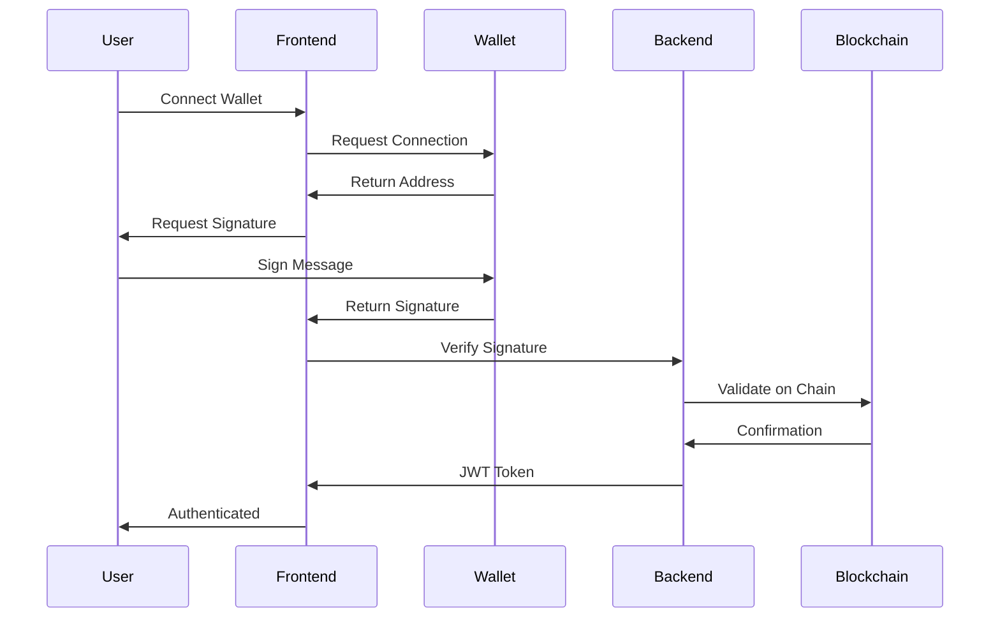
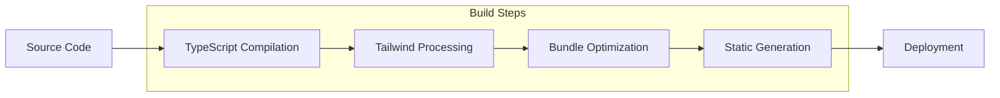

# 🏗️ Tourii Frontend Architecture

This document provides a comprehensive overview of the Tourii frontend architecture patterns, technical decisions, and system design.

---

## 🗺️ **System Architecture Overview**

```mermaid
graph TB
    subgraph "User Interface Layer"
        WEB[Web Browser]
        MOBILE[Mobile Browser]
        PWA[PWA App]
    end
    
    subgraph "Next.js Frontend Application"
        subgraph "Pages & Routing"
            HOMEPAGE[Homepage Landing]
            AUTH[Authentication Pages]
            DASHBOARD[User Dashboard]
            STORIES[Story System]
            ROUTES[Model Routes]
            QUESTS[Quest System]
            ADMIN[Admin Panel]
        end
        
        subgraph "Component Architecture"
            UI[shadcn/ui Components]
            DOMAIN[Domain Components]
            COMMON[Common Components]
            STORIES_COMP[Story Components]
            ROUTE_COMP[Route Components]
            QUEST_COMP[Quest Components]
        end
        
        subgraph "State Management"
            SWR[SWR Hooks<br/>Server State]
            REDUX[Redux Toolkit<br/>UI State]
            CONTEXT[React Context<br/>App State]
        end
        
        subgraph "Custom Hooks"
            API_HOOKS[API Hooks<br/>Data Fetching]
            UI_HOOKS[UI Hooks<br/>Interactions]
            BIZ_HOOKS[Business Hooks<br/>Logic]
            MAP_HOOKS[Map Hooks<br/>Geolocation]
        end
    end
    
    subgraph "API Layer"
        subgraph "Next.js API Routes"
            AUTH_API[/api/auth/*]
            STORIES_API[/api/stories/*]
            ROUTES_API[/api/routes/*]
            QUESTS_API[/api/quests/*]
            UPLOAD_API[/api/upload/*]
        end
        
        subgraph "Generated SDK"
            OPENAPI[OpenAPI Client<br/>Auto-generated]
            TYPES[TypeScript Types<br/>Auto-generated]
        end
    end
    
    subgraph "External Services"
        BACKEND[Tourii Backend<br/>NestJS API]
        WEB3[Web3 Services<br/>Blockchain]
        STORAGE[IPFS/NFT.Storage<br/>File Storage]
        MAPS[Leaflet Maps<br/>Geolocation]
        WEBSOCKET[WebSocket<br/>Real-time]
    end
    
    %% User Flow
    WEB --> HOMEPAGE
    MOBILE --> HOMEPAGE
    PWA --> HOMEPAGE
    
    %% Page Navigation
    HOMEPAGE --> AUTH
    AUTH --> DASHBOARD
    DASHBOARD --> STORIES
    DASHBOARD --> ROUTES
    DASHBOARD --> QUESTS
    DASHBOARD --> ADMIN
    
    %% Component Dependencies
    STORIES --> STORIES_COMP
    ROUTES --> ROUTE_COMP
    QUESTS --> QUEST_COMP
    STORIES_COMP --> UI
    ROUTE_COMP --> UI
    QUEST_COMP --> UI
    
    %% State Management Flow
    DOMAIN --> SWR
    DOMAIN --> REDUX
    SWR --> API_HOOKS
    REDUX --> UI_HOOKS
    
    %% API Communication
    API_HOOKS --> AUTH_API
    API_HOOKS --> STORIES_API
    API_HOOKS --> ROUTES_API
    API_HOOKS --> QUESTS_API
    
    %% Generated SDK Usage
    AUTH_API --> OPENAPI
    STORIES_API --> OPENAPI
    ROUTES_API --> OPENAPI
    QUESTS_API --> OPENAPI
    
    %% External Service Integration
    OPENAPI --> BACKEND
    MAP_HOOKS --> MAPS
    BIZ_HOOKS --> WEB3
    UPLOAD_API --> STORAGE
    UI_HOOKS --> WEBSOCKET
    
    %% Styling
    classDef userLayer fill:#e1f5fe
    classDef frontendLayer fill:#f3e5f5
    classDef apiLayer fill:#fff3e0
    classDef externalLayer fill:#e8f5e8
    
    class WEB,MOBILE,PWA userLayer
    class HOMEPAGE,AUTH,DASHBOARD,STORIES,ROUTES,QUESTS,ADMIN,UI,DOMAIN,COMMON,SWR,REDUX,CONTEXT frontendLayer
    class AUTH_API,STORIES_API,ROUTES_API,QUESTS_API,UPLOAD_API,OPENAPI,TYPES apiLayer
    class BACKEND,WEB3,STORAGE,MAPS,WEBSOCKET externalLayer
```

---

## 🔄 **Three-Layer API Architecture**

The project follows a sophisticated proxy pattern that ensures type safety and centralizes backend communication:

### Layer 1: Client-Side SWR Hooks (`src/hooks/api/`)
- Custom hooks that components use for data fetching
- Provide caching, error handling, and loading states
- Call internal Next.js API routes (not backend directly)
- Follow consistent naming pattern: `use*` convention

```typescript
// ✅ CORRECT: Modern hook pattern
export function useModelRoutes(): UseApiHookResult<ModelRouteResponseDto[]> {
  const { data, error, isLoading, mutate } = useProxySWR<ModelRouteResponseDto[]>("/api/routes/model-routes");
  return { data, error, isLoading, mutate };
}

// ❌ WRONG: Deprecated get* pattern
export function getModelRoutes() { ... }
```

### Layer 2: Next.js API Routes (`src/app/api/`)
- Server-side proxy routes that handle authentication and validation
- Use the generated SDK to communicate with backend
- Centralized error handling and response formatting
- Protect API keys from client exposure

```typescript
export async function GET() {
  return executeValidatedServiceCall(
    (apiKey: string, apiVersion: string) =>
      RoutesService.touriiBackendControllerGetModelRoutes(apiVersion, apiKey),
    "GET /api/routes/model-routes"
  );
}
```

### Layer 3: Generated API Client (`src/api/generated/`)
- Auto-generated from OpenAPI specifications
- Provides full TypeScript coverage
- **Never manually edit** - regenerate with `pnpm generate:api`
- Used exclusively by Next.js API routes

---

## 🧩 **Component Architecture**

### Domain-Based Organization

```
src/components/
├── ui/                    # shadcn/ui base components
├── common/                # Shared utility components
├── about/                 # About page components
├── character/             # Character system components
├── header/                # Navigation components
├── homepage/              # Landing page components
├── model-route/           # Route planning components
│   ├── common/            # Shared route components
│   ├── region/            # Region selection
│   ├── route-component/   # Route display
│   └── route-details/     # Route detail views
├── profile/               # User profile components
├── quest/                 # Quest system components
├── story/                 # Story system components
│   ├── chapter-page/      # Chapter navigation
│   ├── common/            # Shared story components
│   └── story-page/        # Story listing
└── world/                 # World/lore components
```

### Component Design Principles

1. **Single Responsibility**: Each component has one clear purpose
2. **Composition over Inheritance**: Use composition patterns for flexibility
3. **Story-Driven Development**: Every component has a `.stories.tsx` file
4. **Mobile-First**: Components are designed mobile-first, desktop-enhanced
5. **Accessibility**: Components follow WCAG guidelines

### Example Component Structure

```typescript
// Component Interface
interface ModelRouteCardProps {
  route: ModelRouteResponseDto;
  onSelect?: (routeId: string) => void;
  variant?: 'default' | 'compact';
  className?: string;
}

// Component Implementation
export function ModelRouteCard({ route, onSelect, variant = 'default', className }: ModelRouteCardProps) {
  // Implementation
}

// Storybook Story
export default {
  title: 'Model Route/RouteCard',
  component: ModelRouteCard,
} as Meta<typeof ModelRouteCard>;
```

---

## 🎣 **Hook Architecture**

### Hook Organization by Purpose

```
src/hooks/
├── api/              # Server data fetching hooks
│   ├── useModelRoutes.ts
│   ├── useQuests.ts
│   └── useSagas.ts
├── business/         # Business logic hooks
│   ├── useSpotImage.ts
│   └── useTouristSpotSelection.ts
├── map/              # Map and geolocation hooks
│   ├── useLeafletLoader.ts
│   └── useMapInitialization.ts
└── ui/               # UI interaction hooks
    ├── useImageGallery.ts
    ├── useIntersectionObserver.ts
    └── useResponsiveDetection.ts
```

### Hook Design Patterns

```typescript
// API Hook Pattern
export function useModelRoutes(): UseApiHookResult<ModelRouteResponseDto[]> {
  const { data, error, isLoading, mutate } = useProxySWR<ModelRouteResponseDto[]>("/api/routes/model-routes");
  return { data, error, isLoading, mutate };
}

// Business Logic Hook Pattern
export function useTouristSpotSelection(routeId: string) {
  const [selectedSpotId, setSelectedSpotId] = useState<string | null>(null);
  const [isModalOpen, setIsModalOpen] = useState(false);
  
  const selectSpot = useCallback((spotId: string) => {
    setSelectedSpotId(spotId);
    setIsModalOpen(true);
  }, []);
  
  return { selectedSpotId, isModalOpen, selectSpot, setIsModalOpen };
}

// UI Hook Pattern
export function useResponsiveDetection() {
  const [isMobile, setIsMobile] = useState(false);
  const [isTablet, setIsTablet] = useState(false);
  
  useEffect(() => {
    // Implementation
  }, []);
  
  return { isMobile, isTablet, isDesktop: !isMobile && !isTablet };
}
```

---

## 🗃️ **State Management Strategy**

### Clear Separation of Concerns

```typescript
// ✅ CORRECT: Use SWR for server data
const { data: quests, isLoading, mutate } = useQuests();

// ✅ CORRECT: Use Redux only for UI state
const selectedQuestId = useAppSelector(selectSelectedQuestId);
dispatch(setSelectedQuest(questId));

// ❌ WRONG: Don't store server data in Redux
dispatch(setQuests(apiResponse)); // Anti-pattern!
```

### Redux Store Structure

```
src/lib/redux/features/
├── chapter/          # Chapter UI state
├── character/        # Character selection state
├── homepage/         # Homepage UI state
├── passport/         # Passport UI state
└── stories/          # Story navigation state
```

### SWR Configuration

```typescript
// Global SWR configuration
export const swrConfig: SWRConfiguration = {
  fetcher: proxyFetcher,
  revalidateOnFocus: false,
  revalidateOnReconnect: true,
  dedupingInterval: 5000,
  errorRetryCount: 3,
};
```

---

## 🗺️ **Routing Architecture**

### Next.js App Router Structure

```
src/app/
├── (homepage)/          # Landing page (path: /)
├── (info)/             # Info pages (/about, /world)
├── (story)/            # Character page (/character)
├── profile-dev/        # Profile pages
└── v2/                 # Main application
    ├── (auth)/         # Authentication (/v2/complete-profile, etc.)
    ├── (dashboard)/    # Dashboard (/v2/dashboard)
    ├── (admin)/        # Admin panel (/v2/admin/*)
    ├── (homepage)/     # App homepage (/v2/)
    ├── (quests)/       # Quest system (/v2/quests/*)
    ├── (routes)/       # Model routes (/v2/region/*)
    └── (stories)/      # Story system (/v2/touriiverse/*)
```

### Route Groups and Layouts

- **Route Groups**: `()` syntax for organizing without affecting URL
- **Nested Layouts**: Each route group can have its own layout
- **Dynamic Routes**: `[param]` for dynamic segments
- **Catch-all Routes**: `[...param]` for flexible routing

---

## 🎨 **Styling Architecture**

### Tailwind CSS Configuration

```typescript
// tailwind.config.ts - Custom theme
theme: {
  extend: {
    colors: {
      warmGrey: { /* custom warm grey palette */ },
      charcoal: { /* custom charcoal palette */ },
      red: { /* custom red palette */ },
    },
    screens: {
      'mobile': '375px',
      'tablet': '768px',
      'desktop': '1024px',
    }
  }
}
```

### Component Styling Patterns

```typescript
// Using clsx for conditional styles
import { clsx } from 'clsx';

export function Button({ variant, size, className, ...props }: ButtonProps) {
  return (
    <button
      className={clsx(
        'inline-flex items-center justify-center rounded-md font-medium',
        {
          'bg-primary text-primary-foreground': variant === 'default',
          'border border-input': variant === 'outline',
        },
        {
          'h-10 px-4 py-2': size === 'default',
          'h-8 px-3': size === 'sm',
        },
        className
      )}
      {...props}
    />
  );
}
```

---

## 🌐 **Web3 Integration Architecture**

### Wallet Connection Flow



### Web3 Hook Pattern

```typescript
export function useWalletConnection() {
  const [address, setAddress] = useState<string | null>(null);
  const [isConnecting, setIsConnecting] = useState(false);
  
  const connect = useCallback(async () => {
    setIsConnecting(true);
    try {
      // Web3 connection logic
    } finally {
      setIsConnecting(false);
    }
  }, []);
  
  return { address, isConnecting, connect };
}
```

---

## 📊 **Performance Architecture**

### Code Splitting Strategy

```typescript
// Route-based code splitting
const QuestPage = dynamic(() => import('./quest-page'), {
  loading: () => <QuestPageSkeleton />,
});

// Component-based code splitting
const HeavyComponent = dynamic(() => import('./heavy-component'), {
  ssr: false,
});
```

### Image Optimization

```typescript
// Next.js Image component usage
import Image from 'next/image';

<Image
  src="/image/path.jpg"
  alt="Description"
  width={400}
  height={300}
  priority={isAboveFold}
  sizes="(max-width: 768px) 100vw, (max-width: 1200px) 50vw, 33vw"
/>
```

### Bundle Analysis

```bash
# Bundle analysis commands
pnpm build && pnpm analyze
```

---

## 🔒 **Security Architecture**

### API Security

- **Proxy Pattern**: API keys protected in Next.js API routes
- **Request Validation**: All inputs validated using Zod schemas
- **CSRF Protection**: Built-in Next.js CSRF protection
- **Rate Limiting**: Implemented at API route level

### XSS Prevention

```typescript
// Safe HTML rendering
import DOMPurify from 'dompurify';

function SafeHTML({ content }: { content: string }) {
  const sanitized = DOMPurify.sanitize(content);
  return <div dangerouslySetInnerHTML={{ __html: sanitized }} />;
}
```

---

## 🧪 **Testing Architecture**

### Testing Strategy

```
tests/
├── __tests__/           # Unit tests
├── __e2e__/            # End-to-end tests
├── __mocks__/          # Mock implementations
└── utils/              # Test utilities
```

### Component Testing Pattern

```typescript
import { render, screen } from '@testing-library/react';
import { ModelRouteCard } from './model-route-card';

describe('ModelRouteCard', () => {
  it('renders route information correctly', () => {
    const mockRoute = { /* mock data */ };
    render(<ModelRouteCard route={mockRoute} />);
    
    expect(screen.getByText(mockRoute.title)).toBeInTheDocument();
  });
});
```

---

## 📝 **Documentation Standards**

### Storybook Integration

Every component must have a corresponding `.stories.tsx` file:

```typescript
export default {
  title: 'Components/ModelRoute/RouteCard',
  component: ModelRouteCard,
  parameters: {
    docs: {
      description: {
        component: 'A card component for displaying model route information.',
      },
    },
  },
} as Meta<typeof ModelRouteCard>;
```

### TSDoc Comments

```typescript
/**
 * A reusable card component for displaying model route information.
 * 
 * @param route - The model route data to display
 * @param onSelect - Callback fired when the route is selected
 * @param variant - Visual variant of the card
 * @param className - Additional CSS classes
 * 
 * @example
 * ```tsx
 * <ModelRouteCard 
 *   route={routeData} 
 *   onSelect={(id) => console.log(id)}
 *   variant="compact" 
 * />
 * ```
 */
export function ModelRouteCard({ route, onSelect, variant, className }: ModelRouteCardProps) {
  // Implementation
}
```

---

## 🚀 **Deployment Architecture**

### Build Process



### Environment Configuration

```typescript
// Environment validation with Zod
export const env = createEnv({
  server: {
    TOURII_BACKEND_API_KEY: z.string(),
    NODE_ENV: z.enum(['development', 'production', 'test']),
  },
  client: {
    NEXT_PUBLIC_APP_URL: z.string().url(),
    NEXT_PUBLIC_API_BASE_URL: z.string().url(),
  },
  runtimeEnv: {
    TOURII_BACKEND_API_KEY: process.env.TOURII_BACKEND_API_KEY,
    NODE_ENV: process.env.NODE_ENV,
    NEXT_PUBLIC_APP_URL: process.env.NEXT_PUBLIC_APP_URL,
    NEXT_PUBLIC_API_BASE_URL: process.env.NEXT_PUBLIC_API_BASE_URL,
  },
});
```

---

*Last Updated: June 17, 2025*