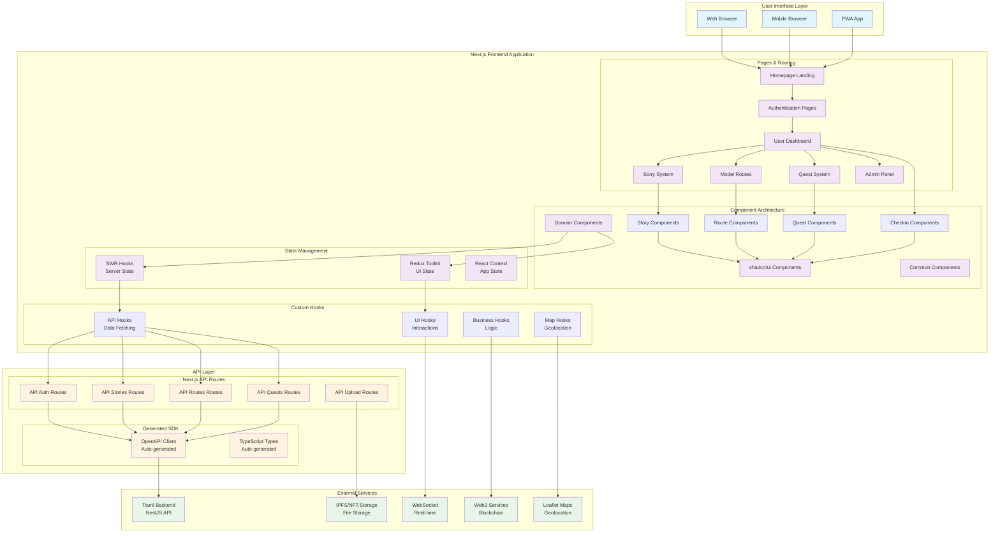
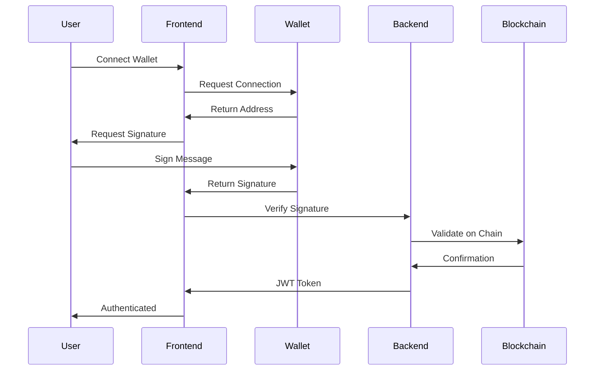
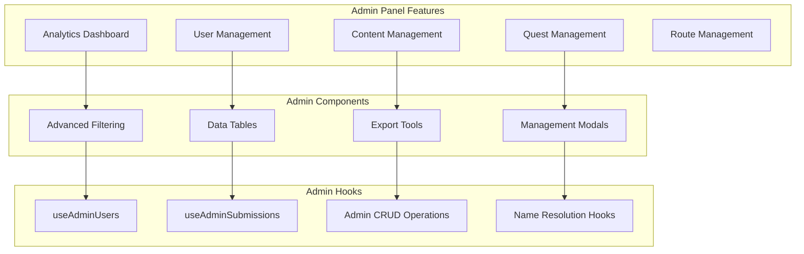
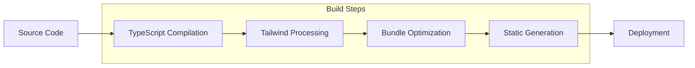

# 🏗️ Tourii Frontend Architecture

This document provides a high-level overview of the Tourii frontend architecture, system design decisions, and architectural patterns.

---

## 🗺️ **System Architecture Overview**



---

## 🎯 **Architectural Principles**

### 1. Three-Layer API Pattern
Components never directly call the backend. All API communication follows:
**SWR Hooks** → **Next.js API Routes** → **Generated SDK** → **Backend**

This ensures type safety, centralized error handling, and API key protection.

### 2. State Management Strategy
- **SWR**: Server state and caching
- **Redux Toolkit**: UI state only (selections, modal states, filters)
- **React Context**: App-level configuration and theme state

### 3. Component Architecture
- **Domain-based organization**: Components grouped by business domain
- **Composition over inheritance**: Flexible, reusable component patterns
- **Mobile-first design**: Optimized for mobile with desktop enhancements

---

## 🧩 **Component Architecture**

### Domain-Based Organization

Components are organized by business domain rather than technical type:

```
src/components/
├── ui/                    # Base UI components (shadcn/ui)
├── common/                # Shared utility components
├── model-route/           # Route planning system
├── story/                 # Story and chapter system
├── quest/                 # Quest and task system
├── checkin/               # Travel log and checkin system
├── profile/               # User profile and achievements
├── header/                # Navigation and authentication
├── homepage/              # Landing and marketing pages
├── admin/                 # Admin panel components (user management, analytics)
├── about/                 # About page components
├── character/             # Character showcase components
└── world/                 # World exploration components
```

### Design Principles

- **Single Responsibility**: Each component has one clear purpose
- **Composition Patterns**: Components can be composed flexibly
- **Story-Driven Development**: Every component has Storybook documentation
- **Mobile-First Design**: Optimized for mobile with desktop enhancements
- **TypeScript Interfaces**: Full type safety with clear prop contracts

---

## 🎣 **Hook Architecture** ✅ **Recently Reorganized**

### Purpose-Based Organization

Hooks are organized by their primary purpose across 5 categories with 30 total hooks:

```
src/hooks/
├── api/              # Server data fetching (SWR hooks) - 14 hooks
├── admin/            # Admin CRUD operations + name resolution - 6 hooks ✅ All working
├── business/         # Business logic hooks - 4 hooks
├── ui/               # UI interaction hooks - 3 hooks
└── map/              # Map and geolocation hooks - 2 hooks
```

### Hook Categories & Functions

#### **API Hooks** (14 hooks)
Server data fetching with SWR for read operations:
- `useModelRoutes()`, `useModelRouteById()`, `useQuests()`, `useQuestById()`
- `useCheckins()`, `useSagas()`, `useSagaById()`, `useStoryCompletion()`
- `usePassport()`, `useHomepageHighlights()`, `useMoments()`, `useLocationInfo()`
- `useTaskSubmissions()` (task submission data)

#### **Admin Hooks** (6 hooks) ✅ **All Working**
CRUD operations for content management with proper error handling + comprehensive name resolution:
- Story Management: `useCreateStory()`, `useUpdateStory()`, `useDeleteStory()`
- Quest Management: `useCreateQuest()`, `useUpdateQuest()`, `useDeleteQuest()`
- Route Management: `useCreateModelRoute()`, `useUpdateModelRoute()`, `useDeleteModelRoute()`
- Admin SWR Hooks: `useAdminUsers()`, `useAdminSubmissions()`
- Name Resolution System: `useQuestName()`, `useTouristSpotName()`, `useStoryChapterName()`, `useTaskName()`, `useNameResolution()`

#### **Business Hooks** (4 hooks)
Domain-specific logic and complex state management:
- `useTouristSpotSelection()`, `useQuestUnlock()`, `useVideoCompletion()`

#### **UI Hooks** (3 hooks)
Interface interactions and responsive behavior:
- `useResponsiveDetection()`, `useImageGallery()`, `useIntersectionObserver()`

#### **Map Hooks** (2 hooks)
Geolocation and mapping functionality:
- `useLeafletLoader()`, `useMapInitialization()`

### Pattern Consistency

All hooks follow consistent patterns:
- **API Hooks**: Return `{ data, error, isLoading, mutate }`
- **Admin Hooks**: Return `{ trigger, isMutating, error }` with success callbacks
- **Business Hooks**: Encapsulate domain logic and state management
- **UI Hooks**: Handle interface interactions and responsive behavior
- **Map Hooks**: Manage map initialization and geolocation services

### Critical Admin CRUD Fixes ✅ **Recently Resolved**

All admin delete operations now properly return `{ success: true }` to ensure SWR interprets them as successful operations, resolving the issue where delete operations appeared to fail due to undefined return values.

---

## 🗃️ **State Management Strategy**

### Clear Separation of Concerns

- **SWR**: Server state, caching, and synchronization
- **Redux Toolkit**: UI state only (modal states, selections, filters)
- **React Context**: App-level configuration and themes

### Data Flow

```
Server Data → SWR Hooks → Components
UI State → Redux Store → Components
App Config → React Context → Components
```

---

## 🗺️ **Routing Architecture**

### Next.js App Router Structure

The application uses Next.js App Router with route groups for organization:

```
src/app/
├── (homepage)/          # Public landing page
├── (info)/             # Static info pages (/about, /world)
├── (story)/            # Character showcase (/character)
├── (legal)/            # Legal pages (privacy, terms, cookies)
└── v2/                 # Main application
    ├── (auth)/         # Authentication flow
    ├── (dashboard)/    # User dashboard
    ├── (admin)/        # Complete admin panel system
    │   └── admin/      # Admin dashboard with analytics, user management
    │       ├── analytics/      # Admin analytics dashboard
    │       ├── model-routes/   # Route management interface
    │       ├── stories/        # Story content management
    │       ├── quests/         # Quest management interface
    │       └── users/          # User administration
    ├── (quests)/       # Quest system
    ├── (routes)/       # Model routes
    └── (stories)/      # Story system
```

### Design Patterns

- **Route Groups**: `()` syntax for organization without URL impact
- **Nested Layouts**: Each route group has its own layout and navigation
- **Dynamic Routes**: `[param]` for flexible routing patterns
- **Type-Safe Navigation**: Full TypeScript support for routing

---

## 🎨 **Styling Strategy**

### Tailwind CSS Foundation

- **Custom Design System**: Extended Tailwind with brand colors (warmGrey, charcoal, red)
- **Mobile-First Approach**: All styles start with mobile and enhance for larger screens
- **Component Variants**: Consistent styling patterns across all components
- **Utility-First**: Leverage Tailwind utilities with custom component abstractions

---

## 🌐 **Web3 Integration Architecture**

### Wallet Connection Flow

The application integrates with Web3 wallets for authentication and NFT functionality:



### Integration Strategy

- **Wallet Abstraction**: Support for MetaMask, WalletConnect, and other providers
- **Signature-Based Auth**: Users authenticate by signing messages
- **NFT Integration**: Display and manage digital collectibles
- **Progressive Enhancement**: Web3 features enhance but don't block core functionality

---

## 🔧 **Admin Panel Architecture**

### Comprehensive Admin System

The Tourii admin panel provides complete administrative control over the platform:



### Admin Features ✅ **Recently Enhanced**

- **User Management**: Complete user administration with filtering, banning, role management  
- **Submission Review**: Task approval workflow with photo, social, and text submissions
- **Content Management**: Story, quest, and route CRUD operations with full validation
- **Analytics Dashboard**: Platform metrics, user statistics, quest completion rates
- **Name Resolution**: Convert IDs to human-readable names (Quest #a-BAAA → "Discover Harajiri Falls")
- **Export Capabilities**: CSV export for user data and analytics
- **Advanced Filtering**: Multi-dimensional filtering with pagination and sorting
- **Component Architecture**: 66% code reduction through reusable component composition

### Security Architecture

- **Role-Based Access**: Strict admin role verification
- **Audit Logging**: Complete admin action tracking
- **Data Protection**: Sensitive user data protection
- **Rate Limiting**: Admin endpoint protection

---

## ⚖️ **Legal Pages Architecture**

### Compliance Structure

The legal pages ensure platform compliance and user protection:

```
src/app/(legal)/
├── layout.tsx          # Legal pages layout with navigation
├── privacy/page.tsx    # Privacy policy
├── terms/page.tsx      # Terms of service
└── cookies/page.tsx    # Cookie policy
```

### Legal Page Features

- **Structured Content**: Clear, readable legal documentation
- **Version Control**: Track policy changes and updates
- **User Consent**: Integration with consent management
- **Mobile Optimization**: Responsive legal content
- **Accessibility**: WCAG compliant legal text

### Design Principles

- **Clarity**: Easy-to-understand legal language
- **Navigation**: Clear section organization
- **Updates**: Version tracking for policy changes
- **Compliance**: GDPR, CCPA, and other regulatory compliance

---

## 📊 **Performance Strategy**

### Optimization Techniques

- **Code Splitting**: Route-based and component-based lazy loading
- **Image Optimization**: Next.js Image component with responsive sizing
- **Bundle Analysis**: Regular monitoring of bundle size and dependencies
- **SSR/SSG**: Static generation for marketing pages, SSR for dynamic content

### Caching Strategy

- **SWR Caching**: Intelligent client-side caching with revalidation
- **Next.js Caching**: Built-in caching for API routes and static assets
- **CDN Integration**: Global content delivery for optimal performance

---

## 🔒 **Security Strategy**

### Multi-Layer Security

- **API Proxy Pattern**: Backend API keys never exposed to client
- **Input Validation**: Zod schemas validate all user inputs
- **XSS Prevention**: DOMPurify for safe HTML rendering
- **CSRF Protection**: Built-in Next.js security features
- **Type Safety**: TypeScript prevents many runtime errors

### Authentication Security

- **JWT Tokens**: Secure token-based authentication
- **Wallet Signatures**: Cryptographic proof of wallet ownership
- **Rate Limiting**: Protection against API abuse
- **Environment Isolation**: Secure environment variable management

---

## 🚀 **Deployment Architecture**

### Build Process

The application follows a modern JAMstack deployment pattern:



### Environment Strategy

- **Environment Validation**: Zod schemas ensure all required environment variables
- **Type-Safe Configuration**: Full TypeScript support for environment variables
- **Secure Secrets**: API keys and sensitive data properly isolated
- **Multi-Environment Support**: Development, staging, and production configurations

### Production Considerations

- **Static Generation**: Marketing pages pre-generated for optimal performance
- **Server-Side Rendering**: Dynamic content rendered on-demand
- **CDN Distribution**: Global content delivery for reduced latency
- **Health Monitoring**: Application health checks and error tracking

---

## 📚 **Documentation & Resources**

### Related Documentation

- **[Complete Hook Guide](./HOOK_GUIDE.md)**: Comprehensive hook patterns and examples
- **[API Integration Guide](./API_INTEGRATION.md)**: Complete API implementation guide
- **[Development Guide](./DEVELOPMENT_GUIDE.md)**: Setup, workflows, and coding standards
- **[Security Guidelines](./SECURITY_GUIDELINES.md)**: Security best practices

### Architecture Decision Records

Key architectural decisions are documented for future reference:

- **Three-Layer API Pattern**: Ensures type safety and security
- **Domain-Based Component Organization**: Improves maintainability
- **SWR for Server State**: Optimizes data fetching and caching
- **Mobile-First Design**: Prioritizes mobile user experience
- **TypeScript-First Development**: Prevents runtime errors and improves developer experience

---

*Last Updated: June 23, 2025 - Admin Enhancement & Name Resolution System Edition*