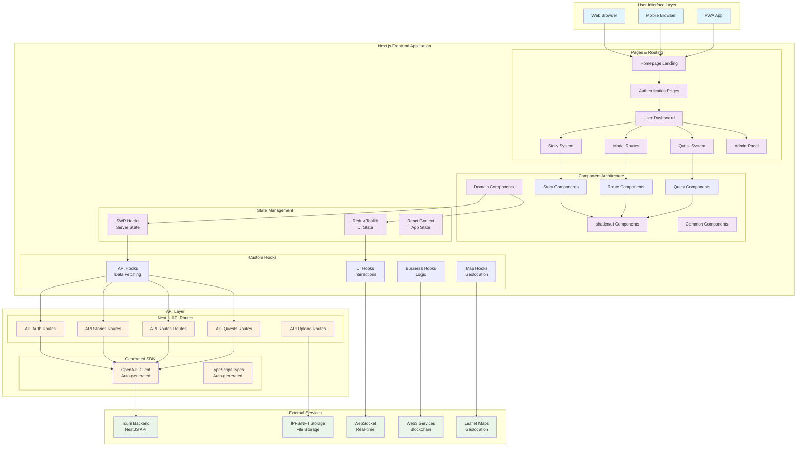

# 🏗️ Tourii Frontend Architecture

This document provides a high-level overview of the Tourii frontend architecture, system design decisions, and architectural patterns.

---

## 🗺️ **System Architecture Overview**



---

## 🎯 **Architectural Principles**

### 1. Three-Layer API Pattern
Components never directly call the backend. All API communication follows:
**SWR Hooks** → **Next.js API Routes** → **Generated SDK** → **Backend**

This ensures type safety, centralized error handling, and API key protection.

### 2. State Management Strategy
- **SWR**: Server state and caching
- **Redux Toolkit**: UI state only (selections, modal states, filters)
- **React Context**: App-level configuration and theme state

### 3. Component Architecture
- **Domain-based organization**: Components grouped by business domain
- **Composition over inheritance**: Flexible, reusable component patterns
- **Mobile-first design**: Optimized for mobile with desktop enhancements

---

## 🧩 **Component Architecture**

### Domain-Based Organization

Components are organized by business domain rather than technical type:

```
src/components/
├── ui/                    # Base UI components (shadcn/ui)
├── common/                # Shared utility components
├── model-route/           # Route planning system
├── story/                 # Story and chapter system
├── quest/                 # Quest and task system
├── profile/               # User profile and achievements
├── header/                # Navigation and authentication
└── homepage/              # Landing and marketing pages
```

### Design Principles

- **Single Responsibility**: Each component has one clear purpose
- **Composition Patterns**: Components can be composed flexibly
- **Story-Driven Development**: Every component has Storybook documentation
- **Mobile-First Design**: Optimized for mobile with desktop enhancements
- **TypeScript Interfaces**: Full type safety with clear prop contracts

---

## 🎣 **Hook Architecture**

### Purpose-Based Organization

Hooks are organized by their primary purpose:

- **API Hooks**: Server data fetching with SWR (`src/hooks/api/`)
- **Business Hooks**: Domain-specific logic (`src/hooks/business/`)
- **UI Hooks**: Interface interactions (`src/hooks/ui/`)
- **Map Hooks**: Geolocation and mapping (`src/hooks/map/`)

### Pattern Consistency

All hooks follow consistent patterns:
- **API Hooks**: Return `{ data, error, isLoading, mutate }`
- **Business Hooks**: Encapsulate domain logic and state
- **UI Hooks**: Handle interface interactions and responsive behavior

---

## 🗃️ **State Management Strategy**

### Clear Separation of Concerns

- **SWR**: Server state, caching, and synchronization
- **Redux Toolkit**: UI state only (modal states, selections, filters)
- **React Context**: App-level configuration and themes

### Data Flow

```
Server Data → SWR Hooks → Components
UI State → Redux Store → Components
App Config → React Context → Components
```

---

## 🗺️ **Routing Architecture**

### Next.js App Router Structure

The application uses Next.js App Router with route groups for organization:

```
src/app/
├── (homepage)/          # Public landing page
├── (info)/             # Static info pages (/about, /world)
├── (story)/            # Character showcase (/character)
└── v2/                 # Main application
    ├── (auth)/         # Authentication flow
    ├── (dashboard)/    # User dashboard
    ├── (admin)/        # Admin panel
    ├── (quests)/       # Quest system
    ├── (routes)/       # Model routes
    └── (stories)/      # Story system
```

### Design Patterns

- **Route Groups**: `()` syntax for organization without URL impact
- **Nested Layouts**: Each route group has its own layout and navigation
- **Dynamic Routes**: `[param]` for flexible routing patterns
- **Type-Safe Navigation**: Full TypeScript support for routing

---

## 🎨 **Styling Strategy**

### Tailwind CSS Foundation

- **Custom Design System**: Extended Tailwind with brand colors (warmGrey, charcoal, red)
- **Mobile-First Approach**: All styles start with mobile and enhance for larger screens
- **Component Variants**: Consistent styling patterns across all components
- **Utility-First**: Leverage Tailwind utilities with custom component abstractions

---

## 🌐 **Web3 Integration Architecture**

### Wallet Connection Flow

The application integrates with Web3 wallets for authentication and NFT functionality:


### Integration Strategy

- **Wallet Abstraction**: Support for MetaMask, WalletConnect, and other providers
- **Signature-Based Auth**: Users authenticate by signing messages
- **NFT Integration**: Display and manage digital collectibles
- **Progressive Enhancement**: Web3 features enhance but don't block core functionality

---

## 📊 **Performance Strategy**

### Optimization Techniques

- **Code Splitting**: Route-based and component-based lazy loading
- **Image Optimization**: Next.js Image component with responsive sizing
- **Bundle Analysis**: Regular monitoring of bundle size and dependencies
- **SSR/SSG**: Static generation for marketing pages, SSR for dynamic content

### Caching Strategy

- **SWR Caching**: Intelligent client-side caching with revalidation
- **Next.js Caching**: Built-in caching for API routes and static assets
- **CDN Integration**: Global content delivery for optimal performance

---

## 🔒 **Security Strategy**

### Multi-Layer Security

- **API Proxy Pattern**: Backend API keys never exposed to client
- **Input Validation**: Zod schemas validate all user inputs
- **XSS Prevention**: DOMPurify for safe HTML rendering
- **CSRF Protection**: Built-in Next.js security features
- **Type Safety**: TypeScript prevents many runtime errors

### Authentication Security

- **JWT Tokens**: Secure token-based authentication
- **Wallet Signatures**: Cryptographic proof of wallet ownership
- **Rate Limiting**: Protection against API abuse
- **Environment Isolation**: Secure environment variable management

---

## 🚀 **Deployment Architecture**

### Build Process

The application follows a modern JAMstack deployment pattern:


### Environment Strategy

- **Environment Validation**: Zod schemas ensure all required environment variables
- **Type-Safe Configuration**: Full TypeScript support for environment variables
- **Secure Secrets**: API keys and sensitive data properly isolated
- **Multi-Environment Support**: Development, staging, and production configurations

### Production Considerations

- **Static Generation**: Marketing pages pre-generated for optimal performance
- **Server-Side Rendering**: Dynamic content rendered on-demand
- **CDN Distribution**: Global content delivery for reduced latency
- **Health Monitoring**: Application health checks and error tracking

---

## 📚 **Documentation & Resources**

### Related Documentation

- **[Complete Hook Guide](./HOOK_GUIDE.md)**: Comprehensive hook patterns and examples
- **[API Integration Guide](./API_INTEGRATION.md)**: Complete API implementation guide
- **[Development Guide](./DEVELOPMENT_GUIDE.md)**: Setup, workflows, and coding standards
- **[Security Guidelines](./SECURITY_GUIDELINES.md)**: Security best practices

### Architecture Decision Records

Key architectural decisions are documented for future reference:

- **Three-Layer API Pattern**: Ensures type safety and security
- **Domain-Based Component Organization**: Improves maintainability
- **SWR for Server State**: Optimizes data fetching and caching
- **Mobile-First Design**: Prioritizes mobile user experience
- **TypeScript-First Development**: Prevents runtime errors and improves developer experience

---

*Last Updated: June 17, 2025*