# 🔒 MCP-Enhanced Tourii Frontend Security Guidelines

This comprehensive guide covers AI-powered security practices for the Tourii frontend, with advanced MCP integration, intelligent threat detection, automated vulnerability prevention, and enhanced user data protection.

*Enhanced with Model Context Protocol (MCP) Integration & AI-Powered Security (June 2025)*

---

## 🏗️ **MCP-Enhanced Security Architecture Overview**

The Tourii frontend follows an AI-powered security-first approach with intelligent threat detection and automated protection:

```mermaid
graph TB
    subgraph "AI Security Intelligence Layer"
        AI_THREAT_DETECTION[AI Threat Detection]
        MCP_VULNERABILITY_SCAN[MCP Vulnerability Scanner]
        INTELLIGENT_MONITORING[Intelligent Security Monitoring]
        PREDICTIVE_ANALYSIS[Predictive Threat Analysis]
        AUTO_REMEDIATION[Automated Security Remediation]
    end
    
    subgraph "Client Layer (AI-Enhanced)"
        BROWSER[Browser/PWA + AI Protection]
        CSP[Content Security Policy + AI Rules]
        XSS[XSS Protection + ML Detection]
        CLIENT_SIDE_ENCRYPTION[Client-Side Encryption]
    end
    
    subgraph "Application Layer (MCP-Validated)"
        AUTH[AI-Enhanced Authentication]
        VALIDATION[Input Validation + AI Filtering]
        SANITIZATION[Data Sanitization + ML Analysis]
        PROXY[API Proxy Pattern + MCP Monitoring]
        RBAC[Role-Based Access Control + AI]
    end
    
    subgraph "Environment Layer (MCP-Secured)"
        ENV[Environment Variables + MCP Validation]
        SECRETS[Secrets Management + AI Encryption]
        KEYS[API Key Protection + Rotation]
        AUDIT[Security Audit Logging + AI Analysis]
    end
    
    subgraph "Network Layer (AI-Monitored)"
        HTTPS[HTTPS/TLS + Certificate Monitoring]
        CORS[CORS Policy + AI Validation]
        HEADERS[Security Headers + Dynamic Updates]
        RATE_LIMITING[AI-Powered Rate Limiting]
    end
    
    subgraph "Real-time Security Operations"
        INCIDENT_RESPONSE[AI Incident Response]
        SECURITY_ANALYTICS[Security Analytics Dashboard]
        COMPLIANCE_MONITORING[Compliance Monitoring]
        THREAT_INTELLIGENCE[Threat Intelligence Feed]
    end
    
    %% AI Security Flow
    AI_THREAT_DETECTION --> MCP_VULNERABILITY_SCAN
    MCP_VULNERABILITY_SCAN --> INTELLIGENT_MONITORING
    INTELLIGENT_MONITORING --> PREDICTIVE_ANALYSIS
    PREDICTIVE_ANALYSIS --> AUTO_REMEDIATION
    
    %% Enhanced Client Security
    BROWSER --> CSP
    CSP --> XSS
    XSS --> CLIENT_SIDE_ENCRYPTION
    CLIENT_SIDE_ENCRYPTION --> AUTH
    
    %% AI-Enhanced Application Security
    AUTH --> VALIDATION
    VALIDATION --> SANITIZATION
    SANITIZATION --> PROXY
    PROXY --> RBAC
    
    %% MCP Environment Security
    RBAC --> ENV
    ENV --> SECRETS
    SECRETS --> KEYS
    KEYS --> AUDIT
    
    %% Network Security with AI
    AUDIT --> HTTPS
    HTTPS --> CORS
    CORS --> HEADERS
    HEADERS --> RATE_LIMITING
    
    %% Real-time Operations
    RATE_LIMITING --> INCIDENT_RESPONSE
    INCIDENT_RESPONSE --> SECURITY_ANALYTICS
    SECURITY_ANALYTICS --> COMPLIANCE_MONITORING
    COMPLIANCE_MONITORING --> THREAT_INTELLIGENCE
    
    %% AI Feedback Loop
    THREAT_INTELLIGENCE --> AI_THREAT_DETECTION
    AUTO_REMEDIATION --> INTELLIGENT_MONITORING
    
    classDef aiLayer fill:#e8f5e8
    classDef clientLayer fill:#e1f5fe
    classDef appLayer fill:#fff3e0
    classDef envLayer fill:#f3e5f5
    classDef networkLayer fill:#ffecb3
    classDef opsLayer fill:#fce4ec
    
    class AI_THREAT_DETECTION,MCP_VULNERABILITY_SCAN,INTELLIGENT_MONITORING,PREDICTIVE_ANALYSIS,AUTO_REMEDIATION aiLayer
    class BROWSER,CSP,XSS,CLIENT_SIDE_ENCRYPTION clientLayer
    class AUTH,VALIDATION,SANITIZATION,PROXY,RBAC appLayer
    class ENV,SECRETS,KEYS,AUDIT envLayer
    class HTTPS,CORS,HEADERS,RATE_LIMITING networkLayer
    class INCIDENT_RESPONSE,SECURITY_ANALYTICS,COMPLIANCE_MONITORING,THREAT_INTELLIGENCE opsLayer
```



### **MCP-Enhanced Security Benefits**

- **AI Threat Detection**: Real-time analysis of security patterns and anomaly detection
- **Predictive Security**: Machine learning models predict and prevent potential threats
- **Automated Remediation**: Instant response to detected vulnerabilities and attacks
- **Intelligent Monitoring**: 24/7 AI-powered security surveillance with context awareness
- **Advanced Encryption**: Dynamic encryption strategies adapted to threat levels
- **Compliance Automation**: Automated compliance checking and reporting

---

## 🔐 **API Security & Three-Layer Pattern**

### The Three-Layer API Pattern for Security

The Tourii frontend uses a three-layer pattern that provides robust security:

```
Components → SWR Hooks → Next.js API Routes → Generated SDK → Backend
```

### Benefits for Security

1. **API Key Protection**: Keys never exposed to client-side code
2. **Input Validation**: Server-side validation at API route level
3. **Error Handling**: Sanitized error messages to client
4. **Rate Limiting**: Centralized throttling at proxy layer
5. **Request Logging**: Comprehensive audit trail

### Implementation Example

```typescript
// ✅ SECURE: Next.js API route with proper validation
// src/app/api/quests/route.ts
import { z } from 'zod';
import { executeValidatedServiceCall } from '../lib/route-helper';

const questFiltersSchema = z.object({
  page: z.number().int().min(1).max(100).default(1),
  limit: z.number().int().min(1).max(50).default(20),
  questType: z.enum(['SOLO', 'GROUP']).optional(),
});

export async function GET(request: Request) {
  const { searchParams } = new URL(request.url);
  
  // Validate and sanitize all inputs
  const filters = questFiltersSchema.parse({
    page: Number(searchParams.get('page')) || 1,
    limit: Number(searchParams.get('limit')) || 20,
    questType: searchParams.get('questType') || undefined,
  });
  
  return executeValidatedServiceCall(
    (apiKey: string, apiVersion: string) =>
      QuestService.getQuests(apiVersion, apiKey, filters.page, filters.limit, filters.questType),
    "GET /api/quests"
  );
}

// ❌ INSECURE: Direct client-side API calls
const response = await fetch('https://backend.com/api/quests', {
  headers: { 'Authorization': `Bearer ${API_KEY}` } // Exposes API key!
});
```

---

## 🤖 **MCP-Enhanced Security Patterns & AI Protection**

### **1. AI-Powered Threat Detection System**

```typescript
// MCP Security Intelligence Integration
interface MCPSecuritySystem {
  threatDetection: AIThreatDetection;
  vulnerabilityScanning: MCPVulnerabilityScanner;
  automaticRemediation: SecurityRemediation;
  realTimeMonitoring: SecurityMonitoring;
}

// AI Threat Detection Engine
class AIThreatDetection {
  async analyzeRequest(request: Request): Promise<ThreatAnalysis> {
    const analysis = await mcpAnalyzeSecurityPatterns(request);
    
    return {
      threatLevel: analysis.threatLevel, // 'low' | 'medium' | 'high' | 'critical'
      detectedThreats: analysis.threats,
      recommendedActions: analysis.actions,
      confidence: analysis.confidenceScore, // 0-1
      shouldBlock: analysis.threatLevel === 'critical'
    };
  }

  async detectAnomalies(userBehavior: UserBehavior): Promise<AnomalyDetection> {
    // AI-powered behavioral analysis
    const baselinePattern = await mcpGetUserBaseline(userBehavior.userId);
    const currentPattern = userBehavior;
    
    const anomalyScore = await mcpCalculateAnomalyScore(baselinePattern, currentPattern);
    
    return {
      isAnomalous: anomalyScore > 0.7,
      anomalyScore,
      suspiciousActivities: await mcpIdentifySuspiciousActivities(currentPattern),
      recommendedResponse: anomalyScore > 0.9 ? 'block' : 'monitor'
    };
  }
}

// Real-time Security Monitoring with MCP
export function useMCPSecurityMonitoring(): SecurityMonitoringHooks {
  const [securityStatus, setSecurityStatus] = useState<SecurityStatus>('secure');
  const [threats, setThreats] = useState<DetectedThreat[]>([]);
  const [metrics, setMetrics] = useState<SecurityMetrics>();

  useEffect(() => {
    // Subscribe to real-time security feed
    const unsubscribe = mcpSecurityStream.subscribe({
      next: (securityUpdate) => {
        setSecurityStatus(securityUpdate.status);
        setThreats(securityUpdate.threats);
        setMetrics(securityUpdate.metrics);
        
        // Automatic threat response
        if (securityUpdate.status === 'critical') {
          mcpActivateEmergencyProtocols(securityUpdate.threats);
        }
      }
    });

    return unsubscribe;
  }, []);

  return {
    securityStatus,
    threats,
    metrics,
    // Manual security actions
    triggerSecurityScan: () => mcpTriggerFullSecurityScan(),
    blockThreat: (threatId: string) => mcpBlockThreat(threatId),
    whitelistUser: (userId: string) => mcpWhitelistUser(userId)
  };
}
```

### **2. MCP-Enhanced API Route Security**

```typescript
// Enhanced Security Middleware with AI Analysis
export async function mcpSecurityMiddleware(
  request: Request,
  context: RequestContext
): Promise<SecurityResponse> {
  // 1. AI-powered request analysis
  const threatAnalysis = await AIThreatDetection.analyzeRequest(request);
  
  if (threatAnalysis.shouldBlock) {
    // Immediate threat blocking
    return {
      block: true,
      reason: 'Critical threat detected',
      threatDetails: threatAnalysis.detectedThreats
    };
  }

  // 2. MCP rate limiting with AI adaptation
  const rateLimitResult = await mcpAdaptiveRateLimit(request, {
    baseLimit: 100, // requests per minute
    aiAdjustment: true, // Allow AI to adjust based on user behavior
    threatLevel: threatAnalysis.threatLevel
  });

  if (rateLimitResult.exceeded) {
    return {
      block: true,
      reason: 'Rate limit exceeded',
      retryAfter: rateLimitResult.retryAfter
    };
  }

  // 3. Advanced input validation with ML
  const validationResult = await mcpValidateInputWithAI(request.body, {
    useMLDetection: true,
    detectInjectionAttempts: true,
    analyzePayloadStructure: true
  });

  if (!validationResult.isValid) {
    return {
      block: true,
      reason: 'Invalid input detected',
      validationErrors: validationResult.errors
    };
  }

  // 4. User behavior analysis
  const userContext = await mcpGetUserContext(request);
  const behaviorAnalysis = await AIThreatDetection.detectAnomalies(userContext.behavior);

  if (behaviorAnalysis.isAnomalous) {
    // Enhanced monitoring but allow request
    mcpIncreaseUserMonitoring(userContext.userId, behaviorAnalysis.anomalyScore);
  }

  return {
    block: false,
    securityMetadata: {
      threatLevel: threatAnalysis.threatLevel,
      anomalyScore: behaviorAnalysis.anomalyScore,
      securityFlags: await mcpGenerateSecurityFlags(request, context)
    }
  };
}

// Enhanced executeValidatedServiceCall with MCP Security
export async function executeValidatedServiceCallMCP<T>(
  serviceCall: (apiKey: string, apiVersion: string) => Promise<T>,
  endpoint: string,
  securityOptions: MCPSecurityOptions = {}
): Promise<Response> {
  try {
    // 1. Pre-execution security analysis
    const securityCheck = await mcpSecurityMiddleware(request, { endpoint });
    
    if (securityCheck.block) {
      return NextResponse.json(
        { 
          error: 'Security validation failed',
          reason: securityCheck.reason,
          requestId: generateSecurityRequestId()
        },
        { status: 403 }
      );
    }

    // 2. Execute with enhanced monitoring
    const startTime = performance.now();
    const result = await serviceCall(
      process.env.TOURII_BACKEND_API_KEY!,
      process.env.TOURII_BACKEND_API_VERSION!
    );
    const executionTime = performance.now() - startTime;

    // 3. Post-execution security analysis
    await mcpAnalyzeExecutionResult({
      endpoint,
      executionTime,
      responseSize: JSON.stringify(result).length,
      securityMetadata: securityCheck.securityMetadata
    });

    // 4. Response sanitization with AI
    const sanitizedResult = await mcpSanitizeResponse(result, {
      removePersonalData: securityOptions.removePersonalData ?? true,
      applyContentFiltering: securityOptions.applyContentFiltering ?? true,
      validateOutputStructure: true
    });

    return NextResponse.json(sanitizedResult);

  } catch (error) {
    // Enhanced error handling with security context
    const securityError = await mcpAnalyzeSecurityError(error, endpoint);
    
    // Log security incident
    await mcpLogSecurityIncident({
      type: 'api_execution_error',
      endpoint,
      error: securityError,
      timestamp: new Date().toISOString(),
      severity: securityError.severity
    });

    return NextResponse.json(
      {
        error: 'Service temporarily unavailable',
        requestId: securityError.requestId,
        // Only include technical details in development
        ...(process.env.NODE_ENV === 'development' && { details: securityError.details })
      },
      { status: 500 }
    );
  }
}
```

### **3. AI-Enhanced Input Validation & Sanitization**

```typescript
// Advanced Input Validation with Machine Learning
class MCPInputValidator {
  // AI-powered SQL injection detection
  static async detectSQLInjection(input: string): Promise<SQLInjectionAnalysis> {
    const analysis = await mcpAnalyzeSQLPatterns(input);
    
    return {
      isSQLInjection: analysis.confidence > 0.8,
      confidence: analysis.confidence,
      detectedPatterns: analysis.patterns,
      suggestedSanitization: analysis.sanitizationSteps
    };
  }

  // XSS detection with context awareness
  static async detectXSS(input: string, context: ValidationContext): Promise<XSSAnalysis> {
    const analysis = await mcpAnalyzeXSSPatterns(input, context);
    
    return {
      isXSS: analysis.riskLevel === 'high',
      riskLevel: analysis.riskLevel,
      detectedVectors: analysis.vectors,
      contextualThreats: analysis.contextualThreats
    };
  }

  // AI-powered data structure validation
  static async validateDataStructure(data: unknown, schema: ValidationSchema): Promise<StructureValidation> {
    // Traditional Zod validation
    const zodResult = schema.safeParse(data);
    
    // AI-enhanced validation
    const aiValidation = await mcpValidateDataStructureAI(data, {
      checkForAnomalies: true,
      detectDataPoisoning: true,
      validateBusinessLogic: true
    });

    return {
      isValid: zodResult.success && aiValidation.isValid,
      zodErrors: zodResult.error?.errors || [],
      aiInsights: aiValidation.insights,
      suggestedFixes: aiValidation.suggestedFixes
    };
  }
}

// Enhanced validation middleware
export const mcpValidationMiddleware = async (
  req: Request,
  schema: z.ZodSchema,
  options: MCPValidationOptions = {}
): Promise<ValidationResult> => {
  const body = await req.json();
  
  // 1. Traditional schema validation
  const schemaValidation = schema.safeParse(body);
  
  // 2. AI-powered security validation
  const securityValidation = await MCPInputValidator.detectSQLInjection(JSON.stringify(body));
  const xssValidation = await MCPInputValidator.detectXSS(JSON.stringify(body), {
    endpoint: req.url,
    userAgent: req.headers.get('user-agent') || ''
  });
  
  // 3. Data structure anomaly detection
  const structureValidation = await MCPInputValidator.validateDataStructure(body, schema);

  // 4. Business logic validation with AI
  const businessValidation = await mcpValidateBusinessLogic(body, {
    endpoint: req.url,
    userContext: await mcpGetUserContext(req)
  });

  const isValid = schemaValidation.success && 
                  !securityValidation.isSQLInjection && 
                  !xssValidation.isXSS && 
                  structureValidation.isValid &&
                  businessValidation.isValid;

  return {
    isValid,
    data: isValid ? schemaValidation.data : undefined,
    errors: [
      ...(schemaValidation.error?.errors || []),
      ...(securityValidation.isSQLInjection ? ['SQL injection detected'] : []),
      ...(xssValidation.isXSS ? ['XSS attack detected'] : []),
      ...structureValidation.aiInsights.warnings,
      ...businessValidation.errors
    ],
    securityMetadata: {
      sqlInjectionRisk: securityValidation.confidence,
      xssRisk: xssValidation.riskLevel,
      structureAnomalies: structureValidation.aiInsights.anomalies,
      businessLogicViolations: businessValidation.violations
    }
  };
};
```

### **4. Real-time Security Monitoring Dashboard**

```typescript
// MCP Security Operations Center
export function SecurityOperationsCenter() {
  const { securityStatus, threats, metrics } = useMCPSecurityMonitoring();
  const { scanResults, scanProject } = useMCPSecurityScan();
  const { validateComponent } = useMCPAccessibilityValidation();

  return (
    <div className="security-operations-center">
      {/* Real-time Threat Monitor */}
      <ThreatMonitorPanel 
        status={securityStatus}
        threats={threats}
        onThreatAction={(threat) => mcpRespondToThreat(threat)}
      />
      
      {/* Security Metrics Dashboard */}
      <SecurityMetricsPanel 
        metrics={metrics}
        onRefresh={() => mcpRefreshSecurityMetrics()}
      />
      
      {/* Vulnerability Scanner */}
      <VulnerabilityScanPanel 
        results={scanResults}
        onScan={scanProject}
        onFix={(vulnerability) => mcpAutoFixVulnerability(vulnerability)}
      />
      
      {/* Compliance Monitor */}
      <CompliancePanel 
        onAudit={() => mcpPerformComplianceAudit()}
        onGenerateReport={() => mcpGenerateComplianceReport()}
      />
    </div>
  );
}
```

---

## 🛡️ **MCP-Enhanced Environment Variable Security**

### Secure Environment Management

```typescript
// src/env.js - Type-safe environment validation with Zod
import { createEnv } from '@t3-oss/env-nextjs';
import { z } from 'zod';

export const env = createEnv({
  server: {
    // Server-only secrets - NEVER expose to client
    TOURII_BACKEND_API_KEY: z.string().min(1),
    GOOGLE_MAPS_API_KEY: z.string().min(1),
    NEXTAUTH_SECRET: z.string().min(32),
    DATABASE_URL: z.string().url().optional(),
  },
  client: {
    // Client-accessible variables - safe to expose
    NEXT_PUBLIC_APP_URL: z.string().url(),
    NEXT_PUBLIC_BACKEND_URL: z.string().url(),
    NEXT_PUBLIC_WALLETCONNECT_PROJECT_ID: z.string(),
  },
  runtimeEnv: {
    TOURII_BACKEND_API_KEY: process.env.TOURII_BACKEND_API_KEY,
    GOOGLE_MAPS_API_KEY: process.env.GOOGLE_MAPS_API_KEY,
    NEXTAUTH_SECRET: process.env.NEXTAUTH_SECRET,
    DATABASE_URL: process.env.DATABASE_URL,
    NEXT_PUBLIC_APP_URL: process.env.NEXT_PUBLIC_APP_URL,
    NEXT_PUBLIC_BACKEND_URL: process.env.NEXT_PUBLIC_BACKEND_URL,
    NEXT_PUBLIC_WALLETCONNECT_PROJECT_ID: process.env.NEXT_PUBLIC_WALLETCONNECT_PROJECT_ID,
  },
  skipValidation: !!process.env.SKIP_ENV_VALIDATION,
  emptyStringAsUndefined: true,
});
```

### Environment Security Rules

```bash
# ✅ SECURE: Server-only variables (no NEXT_PUBLIC_ prefix)
TOURII_BACKEND_API_KEY=secret_key_here
GOOGLE_MAPS_API_KEY=maps_key_here
NEXTAUTH_SECRET=very_long_random_string_32_chars_min

# ✅ SECURE: Client-accessible (NEXT_PUBLIC_ prefix for safe values only)
NEXT_PUBLIC_APP_URL=https://tourii.app
NEXT_PUBLIC_BACKEND_URL=https://api.tourii.app

# ❌ INSECURE: Never expose secrets with NEXT_PUBLIC_ prefix
NEXT_PUBLIC_API_KEY=secret  # This gets bundled in client code!
```

---

## 🚫 **XSS Prevention**

### React's Built-in Protection

```typescript
// ✅ SECURE: React automatically escapes content
function UserProfile({ user }: { user: UserDto }) {
  return (
    <div>
      <h1>{user.username}</h1> {/* Automatically escaped */}
      <p>{user.bio}</p> {/* Automatically escaped */}
    </div>
  );
}

// ⚠️ CAUTION: Only use with trusted, sanitized content
import DOMPurify from 'dompurify';

function SafeHTMLContent({ content }: { content: string }) {
  const sanitizedContent = DOMPurify.sanitize(content, {
    ALLOWED_TAGS: ['p', 'br', 'strong', 'em'],
    ALLOWED_ATTR: []
  });
  
  return <div dangerouslySetInnerHTML={{ __html: sanitizedContent }} />;
}

// ❌ DANGEROUS: Never use dangerouslySetInnerHTML with raw user input
function UnsafeComponent({ userInput }: { userInput: string }) {
  return <div dangerouslySetInnerHTML={{ __html: userInput }} />; // XSS vulnerability!
}
```

### Input Sanitization

```typescript
// Comprehensive input sanitization utility
import validator from 'validator';
import DOMPurify from 'dompurify';

export const sanitizeInput = {
  text: (input: string): string => {
    return validator.escape(input.trim());
  },
  
  email: (input: string): string | null => {
    const normalized = validator.normalizeEmail(input);
    return normalized && validator.isEmail(normalized) ? normalized : null;
  },
  
  url: (input: string): string | null => {
    return validator.isURL(input) ? input : null;
  },
  
  html: (input: string): string => {
    return DOMPurify.sanitize(input, {
      ALLOWED_TAGS: ['p', 'br', 'strong', 'em', 'ul', 'ol', 'li'],
      ALLOWED_ATTR: ['href', 'target'],
      ALLOWED_URI_REGEXP: /^https?:\/\//,
    });
  }
};

// Usage in components
function CommentForm() {
  const [comment, setComment] = useState('');
  
  const handleSubmit = (e: FormEvent) => {
    e.preventDefault();
    
    // Sanitize before sending to API
    const sanitizedComment = sanitizeInput.text(comment);
    
    // Additional validation
    if (sanitizedComment.length < 1 || sanitizedComment.length > 500) {
      toast.error('Comment must be between 1 and 500 characters');
      return;
    }
    
    submitComment(sanitizedComment);
  };
  
  return (
    <form onSubmit={handleSubmit}>
      <textarea
        value={comment}
        onChange={(e) => setComment(e.target.value)}
        maxLength={500}
        placeholder="Share your thoughts..."
      />
      <button type="submit">Submit</button>
    </form>
  );
}
```

---

## 🔒 **Authentication Security**

### Secure Authentication Flow

```typescript
// Secure authentication with NextAuth.js
// src/lib/auth.ts
import NextAuth from 'next-auth';
import GoogleProvider from 'next-auth/providers/google';
import { env } from '@/env';

export const authOptions = {
  providers: [
    GoogleProvider({
      clientId: env.GOOGLE_CLIENT_ID,
      clientSecret: env.GOOGLE_CLIENT_SECRET,
    }),
  ],
  session: {
    strategy: 'jwt' as const,
    maxAge: 24 * 60 * 60, // 24 hours
  },
  jwt: {
    maxAge: 24 * 60 * 60, // 24 hours
  },
  cookies: {
    sessionToken: {
      name: 'next-auth.session-token',
      options: {
        httpOnly: true,
        sameSite: 'lax',
        path: '/',
        secure: process.env.NODE_ENV === 'production',
      },
    },
  },
  callbacks: {
    async jwt({ token, user }) {
      if (user) {
        token.userId = user.id;
      }
      return token;
    },
    async session({ session, token }) {
      if (token.userId) {
        session.user.id = token.userId as string;
      }
      return session;
    },
  },
};

export default NextAuth(authOptions);
```

### Secure Route Protection

```typescript
// src/lib/auth/route-protection.ts
import { getServerSession } from 'next-auth';
import { redirect } from 'next/navigation';
import { authOptions } from '@/lib/auth';

export async function requireAuth() {
  const session = await getServerSession(authOptions);
  
  if (!session) {
    redirect('/auth/signin');
  }
  
  return session;
}

// Usage in protected pages
export default async function ProtectedPage() {
  const session = await requireAuth();
  
  return (
    <div>
      <h1>Welcome, {session.user.name}!</h1>
      {/* Protected content */}
    </div>
  );
}

// Client-side route protection
import { useSession } from 'next-auth/react';
import { useRouter } from 'next/navigation';
import { useEffect } from 'react';

export function useRequireAuth() {
  const { data: session, status } = useSession();
  const router = useRouter();
  
  useEffect(() => {
    if (status === 'loading') return; // Still loading
    
    if (!session) {
      router.push('/auth/signin');
    }
  }, [session, status, router]);
  
  return { session, isLoading: status === 'loading' };
}
```

---

## 🌐 **Web3 Security**

### Secure Wallet Integration

```typescript
// src/lib/web3/wallet-security.ts
import { verifyMessage } from 'ethers/lib/utils';

export class WalletSecurityService {
  // Generate secure nonce for signature verification
  static generateNonce(): string {
    return Array.from(crypto.getRandomValues(new Uint8Array(32)))
      .map(b => b.toString(16).padStart(2, '0'))
      .join('');
  }
  
  // Verify wallet signature
  static async verifyWalletSignature(
    address: string,
    signature: string,
    nonce: string
  ): Promise<boolean> {
    try {
      const message = `Please sign this message to verify your wallet ownership. Nonce: ${nonce}`;
      const recoveredAddress = verifyMessage(message, signature);
      
      return recoveredAddress.toLowerCase() === address.toLowerCase();
    } catch (error) {
      console.error('Signature verification failed:', error);
      return false;
    }
  }
  
  // Validate Ethereum address format
  static isValidAddress(address: string): boolean {
    return /^0x[a-fA-F0-9]{40}$/.test(address);
  }
}

// Secure wallet authentication hook
export function useWalletAuth() {
  const [isConnecting, setIsConnecting] = useState(false);
  
  const connectWallet = useCallback(async () => {
    try {
      setIsConnecting(true);
      
      if (!window.ethereum) {
        throw new Error('MetaMask not installed');
      }
      
      // Request account access
      const accounts = await window.ethereum.request({
        method: 'eth_requestAccounts',
      });
      
      const address = accounts[0];
      
      if (!WalletSecurityService.isValidAddress(address)) {
        throw new Error('Invalid wallet address');
      }
      
      // Generate nonce for signature
      const nonce = WalletSecurityService.generateNonce();
      
      // Request signature
      const message = `Please sign this message to verify your wallet ownership. Nonce: ${nonce}`;
      const signature = await window.ethereum.request({
        method: 'personal_sign',
        params: [message, address],
      });
      
      // Verify signature server-side
      const response = await fetch('/api/auth/wallet/verify', {
        method: 'POST',
        headers: { 'Content-Type': 'application/json' },
        body: JSON.stringify({
          address,
          signature,
          nonce,
          message,
        }),
      });
      
      if (!response.ok) {
        throw new Error('Wallet verification failed');
      }
      
      const { token } = await response.json();
      
      // Store JWT securely
      localStorage.setItem('wallet_auth_token', token);
      
      return { address, token };
    } catch (error) {
      console.error('Wallet connection failed:', error);
      throw error;
    } finally {
      setIsConnecting(false);
    }
  }, []);
  
  return { connectWallet, isConnecting };
}
```

---

## 🛡️ **Content Security Policy (CSP)**

### Next.js CSP Configuration

```typescript
// next.config.js
const ContentSecurityPolicy = \`
  default-src 'self';
  script-src 'self' 'unsafe-eval' 'unsafe-inline' *.google.com *.gstatic.com;
  style-src 'self' 'unsafe-inline' *.googleapis.com;
  img-src 'self' data: blob: *.googleusercontent.com *.google.com;
  font-src 'self' *.gstatic.com *.googleapis.com;
  connect-src 'self' *.tourii.app *.vercel.app wss: ws:;
  frame-src 'self' *.youtube.com *.google.com;
  media-src 'self' blob: data:;
  object-src 'none';
  base-uri 'self';
  form-action 'self';
  frame-ancestors 'none';
  upgrade-insecure-requests;
\`;

const securityHeaders = [
  {
    key: 'Content-Security-Policy',
    value: ContentSecurityPolicy.replace(/\\s{2,}/g, ' ').trim(),
  },
  {
    key: 'Referrer-Policy',
    value: 'strict-origin-when-cross-origin',
  },
  {
    key: 'X-Frame-Options',
    value: 'DENY',
  },
  {
    key: 'X-Content-Type-Options',
    value: 'nosniff',
  },
  {
    key: 'X-DNS-Prefetch-Control',
    value: 'false',
  },
  {
    key: 'Strict-Transport-Security',
    value: 'max-age=31536000; includeSubDomains',
  },
  {
    key: 'Permissions-Policy',
    value: 'camera=(), microphone=(), geolocation=(self)',
  },
];

module.exports = {
  async headers() {
    return [
      {
        source: '/(.*)',
        headers: securityHeaders,
      },
    ];
  },
};
```

---

## 🔍 **Input Validation & Sanitization**

### Comprehensive Validation Strategy

```typescript
// src/lib/validation/schemas.ts
import { z } from 'zod';

// User input validation schemas
export const userInputSchemas = {
  // Quest creation
  questCreate: z.object({
    title: z.string()
      .min(1, 'Title is required')
      .max(100, 'Title must be under 100 characters')
      .regex(/^[a-zA-Z0-9\s\-_.,!?]+$/, 'Title contains invalid characters'),
    
    description: z.string()
      .max(500, 'Description must be under 500 characters')
      .optional(),
    
    questType: z.enum(['SOLO', 'GROUP']),
    isPremium: z.boolean().default(false),
  }),
  
  // Comment validation
  comment: z.object({
    content: z.string()
      .min(1, 'Comment cannot be empty')
      .max(500, 'Comment must be under 500 characters')
      .refine(
        (content) => !/<script|javascript:|data:/i.test(content),
        'Comment contains potentially dangerous content'
      ),
  }),
  
  // Profile update
  profileUpdate: z.object({
    username: z.string()
      .min(3, 'Username must be at least 3 characters')
      .max(20, 'Username must be under 20 characters')
      .regex(/^[a-zA-Z0-9_-]+$/, 'Username can only contain letters, numbers, hyphens, and underscores'),
    
    bio: z.string()
      .max(200, 'Bio must be under 200 characters')
      .optional(),
    
    email: z.string()
      .email('Invalid email format')
      .optional(),
  }),
};

// Server-side validation middleware
export function validateRequest<T>(schema: z.ZodSchema<T>) {
  return async (request: Request): Promise<{ data: T; error: null } | { data: null; error: string }> => {
    try {
      const body = await request.json();
      const data = schema.parse(body);
      return { data, error: null };
    } catch (error) {
      if (error instanceof z.ZodError) {
        const errorMessage = error.errors
          .map(err => \`\${err.path.join('.')}: \${err.message}\`)
          .join(', ');
        return { data: null, error: errorMessage };
      }
      return { data: null, error: 'Invalid request data' };
    }
  };
}

// Usage in API routes
export async function POST(request: Request) {
  const { data, error } = await validateRequest(userInputSchemas.questCreate)(request);
  
  if (error) {
    return Response.json({ error }, { status: 400 });
  }
  
  // Process validated data
  return executeValidatedServiceCall(
    (apiKey: string, apiVersion: string) =>
      QuestService.createQuest(apiVersion, apiKey, data),
    'POST /api/quests/create'
  );
}
```

---

## 📊 **Rate Limiting & DDoS Protection**

### Next.js Middleware Rate Limiting

```typescript
// src/middleware.ts
import { NextRequest, NextResponse } from 'next/server';
import { Ratelimit } from '@upstash/ratelimit';
import { Redis } from '@upstash/redis';

const redis = new Redis({
  url: process.env.UPSTASH_REDIS_REST_URL!,
  token: process.env.UPSTASH_REDIS_REST_TOKEN!,
});

// Create different rate limiters for different endpoints
const rateLimiters = {
  // General API rate limit: 100 requests per minute
  api: new Ratelimit({
    redis,
    limiter: Ratelimit.slidingWindow(100, '1 m'),
    analytics: true,
  }),
  
  // Auth endpoints: 10 requests per minute
  auth: new Ratelimit({
    redis,
    limiter: Ratelimit.slidingWindow(10, '1 m'),
    analytics: true,
  }),
  
  // Story completion: 30 requests per minute
  storyCompletion: new Ratelimit({
    redis,
    limiter: Ratelimit.slidingWindow(30, '1 m'),
    analytics: true,
  }),
};

export async function middleware(request: NextRequest) {
  const ip = request.ip ?? '127.0.0.1';
  const pathname = request.nextUrl.pathname;
  
  // Determine which rate limiter to use
  let rateLimit = rateLimiters.api; // default
  
  if (pathname.startsWith('/api/auth/')) {
    rateLimit = rateLimiters.auth;
  } else if (pathname.includes('/complete')) {
    rateLimit = rateLimiters.storyCompletion;
  }
  
  // Check rate limit
  const { success, limit, reset, remaining } = await rateLimit.limit(ip);
  
  if (!success) {
    return new NextResponse('Too Many Requests', {
      status: 429,
      headers: {
        'X-RateLimit-Limit': limit.toString(),
        'X-RateLimit-Remaining': remaining.toString(),
        'X-RateLimit-Reset': new Date(reset).toISOString(),
        'Retry-After': Math.round((reset - Date.now()) / 1000).toString(),
      },
    });
  }
  
  // Add rate limit headers to successful responses
  const response = NextResponse.next();
  response.headers.set('X-RateLimit-Limit', limit.toString());
  response.headers.set('X-RateLimit-Remaining', remaining.toString());
  response.headers.set('X-RateLimit-Reset', new Date(reset).toISOString());
  
  return response;
}

export const config = {
  matcher: [
    '/api/:path*',
    '/((?!_next/static|_next/image|favicon.ico).*)',
  ],
};
```

---

## 🔐 **Secure File Upload**

### Safe File Upload Implementation

```typescript
// src/lib/upload/secure-upload.ts
export const ALLOWED_FILE_TYPES = {
  images: ['image/jpeg', 'image/png', 'image/webp', 'image/gif'],
  documents: ['application/pdf', 'text/plain'],
} as const;

export const MAX_FILE_SIZES = {
  image: 5 * 1024 * 1024, // 5MB
  document: 10 * 1024 * 1024, // 10MB
} as const;

export class SecureFileUpload {
  static validateFile(file: File, type: 'image' | 'document'): { valid: boolean; error?: string } {
    // Check file size
    const maxSize = MAX_FILE_SIZES[type];
    if (file.size > maxSize) {
      return {
        valid: false,
        error: \`File size must be under \${Math.round(maxSize / 1024 / 1024)}MB\`,
      };
    }
    
    // Check file type
    const allowedTypes = type === 'image' ? ALLOWED_FILE_TYPES.images : ALLOWED_FILE_TYPES.documents;
    if (!allowedTypes.includes(file.type as any)) {
      return {
        valid: false,
        error: \`File type \${file.type} is not allowed\`,
      };
    }
    
    // Check for malicious file extensions
    const fileName = file.name.toLowerCase();
    const dangerousExtensions = ['.exe', '.scr', '.bat', '.cmd', '.pif', '.vbs', '.js'];
    
    if (dangerousExtensions.some(ext => fileName.endsWith(ext))) {
      return {
        valid: false,
        error: 'File type not allowed for security reasons',
      };
    }
    
    return { valid: true };
  }
  
  static async uploadFile(file: File, type: 'image' | 'document'): Promise<string> {
    const validation = this.validateFile(file, type);
    if (!validation.valid) {
      throw new Error(validation.error);
    }
    
    const formData = new FormData();
    formData.append('file', file);
    formData.append('type', type);
    
    const response = await fetch('/api/upload', {
      method: 'POST',
      body: formData,
    });
    
    if (!response.ok) {
      const error = await response.json();
      throw new Error(error.message || 'Upload failed');
    }
    
    const { url } = await response.json();
    return url;
  }
}

// Secure file upload API route
// src/app/api/upload/route.ts
import { NextRequest, NextResponse } from 'next/server';
import { SecureFileUpload } from '@/lib/upload/secure-upload';

export async function POST(request: NextRequest) {
  try {
    const formData = await request.formData();
    const file = formData.get('file') as File;
    const type = formData.get('type') as 'image' | 'document';
    
    if (!file) {
      return NextResponse.json({ error: 'No file provided' }, { status: 400 });
    }
    
    // Validate file
    const validation = SecureFileUpload.validateFile(file, type);
    if (!validation.valid) {
      return NextResponse.json({ error: validation.error }, { status: 400 });
    }
    
    // Process upload (integrate with your storage service)
    const buffer = await file.arrayBuffer();
    const fileName = \`\${Date.now()}-\${crypto.randomUUID()}\${getFileExtension(file.name)}\`;
    
    // Upload to secure storage (S3, Cloudinary, etc.)
    const url = await uploadToStorage(buffer, fileName, file.type);
    
    return NextResponse.json({ url });
  } catch (error) {
    console.error('Upload error:', error);
    return NextResponse.json(
      { error: 'Upload failed' },
      { status: 500 }
    );
  }
}
```

---

## 📱 **Mobile Security Considerations**

### PWA Security

```typescript
// src/lib/pwa/security.ts
export class PWASecurityService {
  // Detect if running in PWA mode
  static isPWA(): boolean {
    return window.matchMedia('(display-mode: standalone)').matches ||
           (window.navigator as any).standalone === true;
  }
  
  // Validate app integrity
  static async validateAppIntegrity(): Promise<boolean> {
    try {
      // Check if running on expected domain
      const expectedDomains = ['tourii.app', 'app.tourii.com'];
      const currentDomain = window.location.hostname;
      
      if (!expectedDomains.some(domain => currentDomain.includes(domain))) {
        console.warn('App running on unexpected domain');
        return false;
      }
      
      // Check for HTTPS
      if (window.location.protocol !== 'https:' && window.location.hostname !== 'localhost') {
        console.warn('App not running over HTTPS');
        return false;
      }
      
      return true;
    } catch (error) {
      console.error('App integrity check failed:', error);
      return false;
    }
  }
  
  // Secure local storage wrapper
  static secureStorage = {
    setItem(key: string, value: string): void {
      try {
        // Only store in secure contexts
        if (!window.isSecureContext) {
          console.warn('Attempting to store data in insecure context');
          return;
        }
        
        localStorage.setItem(key, value);
      } catch (error) {
        console.error('Failed to store data securely:', error);
      }
    },
    
    getItem(key: string): string | null {
      try {
        return localStorage.getItem(key);
      } catch (error) {
        console.error('Failed to retrieve data:', error);
        return null;
      }
    },
    
    removeItem(key: string): void {
      try {
        localStorage.removeItem(key);
      } catch (error) {
        console.error('Failed to remove data:', error);
      }
    },
  };
}
```

---

## 🚨 **Security Monitoring & Logging**

### Comprehensive Security Logging

```typescript
// src/lib/security/monitoring.ts
export enum SecurityEventType {
  AUTH_ATTEMPT = 'auth_attempt',
  AUTH_SUCCESS = 'auth_success',
  AUTH_FAILURE = 'auth_failure',
  SUSPICIOUS_REQUEST = 'suspicious_request',
  XSS_ATTEMPT = 'xss_attempt',
  INVALID_INPUT = 'invalid_input',
  RATE_LIMIT_HIT = 'rate_limit_hit',
  FILE_UPLOAD = 'file_upload',
  API_ERROR = 'api_error',
}

interface SecurityEvent {
  type: SecurityEventType;
  userId?: string;
  ip: string;
  userAgent: string;
  timestamp: Date;
  details: Record<string, any>;
  severity: 'low' | 'medium' | 'high' | 'critical';
}

export class SecurityMonitor {
  private static async logEvent(event: SecurityEvent): Promise<void> {
    try {
      // Log to console in development
      if (process.env.NODE_ENV === 'development') {
        console.log('Security Event:', event);
      }
      
      // Send to monitoring service in production
      if (process.env.NODE_ENV === 'production') {
        await fetch('/api/security/log', {
          method: 'POST',
          headers: { 'Content-Type': 'application/json' },
          body: JSON.stringify(event),
        });
      }
    } catch (error) {
      console.error('Failed to log security event:', error);
    }
  }
  
  static async logAuthAttempt(userId: string, success: boolean, ip: string, userAgent: string): Promise<void> {
    await this.logEvent({
      type: success ? SecurityEventType.AUTH_SUCCESS : SecurityEventType.AUTH_FAILURE,
      userId,
      ip,
      userAgent,
      timestamp: new Date(),
      details: { method: 'credential_login' },
      severity: success ? 'low' : 'medium',
    });
  }
  
  static async logSuspiciousRequest(request: Request, reason: string): Promise<void> {
    const ip = request.headers.get('x-forwarded-for') || 'unknown';
    const userAgent = request.headers.get('user-agent') || 'unknown';
    
    await this.logEvent({
      type: SecurityEventType.SUSPICIOUS_REQUEST,
      ip,
      userAgent,
      timestamp: new Date(),
      details: {
        url: request.url,
        method: request.method,
        reason,
      },
      severity: 'high',
    });
  }
  
  static async logXSSAttempt(input: string, ip: string, userAgent: string): Promise<void> {
    await this.logEvent({
      type: SecurityEventType.XSS_ATTEMPT,
      ip,
      userAgent,
      timestamp: new Date(),
      details: {
        input: input.substring(0, 100), // Only log first 100 chars
        inputLength: input.length,
      },
      severity: 'critical',
    });
  }
}

// Usage in API routes
export async function POST(request: Request) {
  try {
    const body = await request.text();
    
    // Check for potential XSS attempts
    if (/<script|javascript:|data:/i.test(body)) {
      await SecurityMonitor.logXSSAttempt(
        body,
        request.headers.get('x-forwarded-for') || 'unknown',
        request.headers.get('user-agent') || 'unknown'
      );
      
      return Response.json(
        { error: 'Invalid request content' },
        { status: 400 }
      );
    }
    
    // Process request normally
    // ...
  } catch (error) {
    console.error('Request processing error:', error);
    return Response.json(
      { error: 'Internal server error' },
      { status: 500 }
    );
  }
}
```

---

## 🔧 **Security Testing & Validation**

### Automated Security Testing

```typescript
// tests/security/security.test.ts
import { describe, it, expect } from 'vitest';
import { validateEnvironment } from '@/env';
import { SecurityMonitor } from '@/lib/security/monitoring';
import { sanitizeInput } from '@/lib/validation/sanitize';

describe('Security Tests', () => {
  describe('Environment Security', () => {
    it('should not expose sensitive environment variables to client', () => {
      // Check that sensitive env vars are not in window object
      expect(typeof window !== 'undefined' && (window as any).process?.env?.TOURII_BACKEND_API_KEY).toBeUndefined();
      expect(typeof window !== 'undefined' && (window as any).process?.env?.NEXTAUTH_SECRET).toBeUndefined();
    });
    
    it('should validate environment configuration', () => {
      expect(() => validateEnvironment()).not.toThrow();
    });
  });
  
  describe('Input Sanitization', () => {
    it('should sanitize XSS attempts', () => {
      const maliciousInput = '<script>alert("xss")</script>';
      const sanitized = sanitizeInput.text(maliciousInput);
      
      expect(sanitized).not.toContain('<script>');
      expect(sanitized).not.toContain('alert');
    });
    
    it('should handle SQL injection attempts', () => {
      const sqlInjection = "'; DROP TABLE users; --";
      const sanitized = sanitizeInput.text(sqlInjection);
      
      expect(sanitized).not.toContain('DROP TABLE');
      expect(sanitized).not.toContain(';');
    });
  });
  
  describe('API Security', () => {
    it('should reject requests without proper headers', async () => {
      const response = await fetch('/api/test', {
        method: 'POST',
        body: JSON.stringify({ test: 'data' }),
        // Missing Content-Type header
      });
      
      expect(response.status).toBe(400);
    });
    
    it('should enforce rate limiting', async () => {
      // This would require a test environment with rate limiting enabled
      // Implementation depends on your testing setup
    });
  });
});
```

---

## 📋 **Security Checklist**

### Development Security Checklist

- [ ] **Environment Variables**
  - [ ] All secrets use server-only environment variables (no NEXT_PUBLIC_ prefix)
  - [ ] Environment validation with Zod schemas
  - [ ] No hardcoded API keys or secrets in code
  - [ ] Proper .env files for different environments

- [ ] **API Security**
  - [ ] Three-layer API pattern implemented
  - [ ] All user inputs validated with Zod
  - [ ] Proper error handling without information leakage
  - [ ] Rate limiting on all endpoints
  - [ ] API keys properly protected server-side

- [ ] **Authentication & Authorization**
  - [ ] Secure session management
  - [ ] Proper JWT token handling
  - [ ] Protected routes implementation
  - [ ] Wallet signature verification for Web3 auth

- [ ] **Input Validation**
  - [ ] All user inputs sanitized
  - [ ] XSS prevention measures in place
  - [ ] File upload validation and restrictions
  - [ ] SQL injection prevention (through ORM/parameterized queries)

- [ ] **Security Headers**
  - [ ] Content Security Policy configured
  - [ ] HTTPS enforcement
  - [ ] X-Frame-Options set to DENY
  - [ ] X-Content-Type-Options set to nosniff

- [ ] **Frontend Security**
  - [ ] No dangerouslySetInnerHTML without sanitization
  - [ ] Secure local storage usage
  - [ ] Proper error boundaries
  - [ ] Client-side validation (in addition to server-side)

- [ ] **Monitoring & Logging**
  - [ ] Security event logging implemented
  - [ ] Error tracking configured
  - [ ] Suspicious activity detection
  - [ ] Regular security audits scheduled

### Production Security Checklist

- [ ] **Infrastructure**
  - [ ] HTTPS/TLS certificates valid and up-to-date
  - [ ] CDN with DDoS protection enabled
  - [ ] Database access properly restricted
  - [ ] Regular dependency updates

- [ ] **Monitoring**
  - [ ] Security monitoring dashboard configured
  - [ ] Alert system for security events
  - [ ] Log aggregation and analysis
  - [ ] Regular penetration testing

- [ ] **Compliance**
  - [ ] GDPR compliance for user data
  - [ ] Privacy policy and terms of service updated
  - [ ] Data retention policies implemented
  - [ ] User consent management

---

## 🚨 **Incident Response**

### Security Incident Response Plan

1. **Detection**: Monitor logs and alerts for security events
2. **Assessment**: Determine severity and scope of incident
3. **Containment**: Isolate affected systems and prevent spread
4. **Investigation**: Analyze attack vectors and compromised data
5. **Recovery**: Restore systems and implement additional protections
6. **Documentation**: Record incident details and lessons learned

### Emergency Contacts

- **Security Team**: security@tourii.com
- **Development Team**: dev@tourii.com
- **Infrastructure Team**: ops@tourii.com

---

## 📚 **Security Resources**

### 🎥 **YouTube API Security**

The Tourii frontend integrates YouTube content safely using CSP-compliant patterns:

```typescript
// ✅ SECURE: CSP-compliant YouTube API loading
// src/components/common/YouTubeAPILoader.tsx
import Script from 'next/script';

export function YouTubeAPILoader({ onLoad }: { onLoad?: () => void }) {
  return (
    <Script
      src="https://www.youtube.com/iframe_api"
      strategy="afterInteractive"
      onLoad={onLoad}
      onError={(e) => {
        console.error('Failed to load YouTube API:', e);
      }}
    />
  );
}

// ❌ INSECURE: Direct script injection (violates CSP)
const script = document.createElement('script');
script.src = 'https://www.youtube.com/iframe_api';
document.head.appendChild(script); // CSP violation!
```

### YouTube Integration Security Best Practices

- **Use Next.js Script Component**: Ensures CSP compliance and proper loading
- **Validate Video IDs**: Only allow alphanumeric YouTube video IDs
- **Sandbox iframes**: Restrict YouTube embed capabilities
- **Monitor API Usage**: Track and limit YouTube API calls
- **Handle Errors Gracefully**: Fallback for failed YouTube loads

---

### Security Tools & Libraries

- **Input Validation**: Zod, Joi, Yup
- **Sanitization**: DOMPurify, validator.js
- **Authentication**: NextAuth.js, Auth0
- **Rate Limiting**: @upstash/ratelimit, express-rate-limit
- **Security Headers**: @next/security
- **Monitoring**: Sentry, LogRocket, DataDog
- **YouTube Integration**: Next.js Script component for CSP compliance

### Security References

- [OWASP Top 10](https://owasp.org/www-project-top-ten/)
- [Next.js Security Guidelines](https://nextjs.org/docs/pages/building-your-application/configuring/environment-variables)
- [React Security Best Practices](https://react-security.com/)
- [Web3 Security Checklist](https://consensys.github.io/smart-contract-best-practices/)

---

*Last Updated: June 20, 2025*